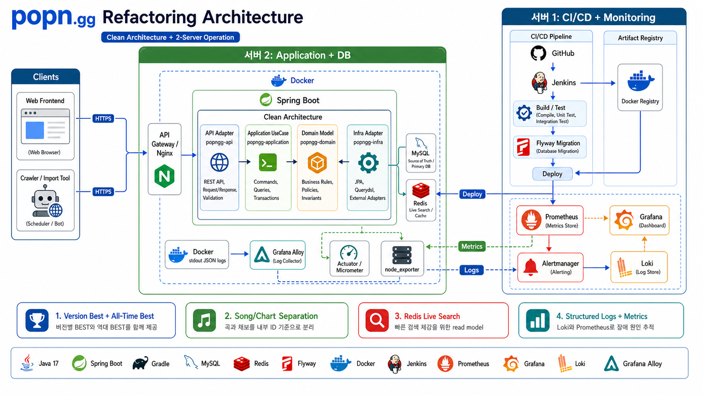

# 아키텍처

popn.gg 백엔드는 헥사고널 아키텍처를 기준으로 새로 구성합니다.

핵심은 비즈니스 규칙을 HTTP, DB, Security, 외부 갱신 수단에서 분리하는 것입니다. Controller, JPA Repository, JWT, crawler 같은 외부 기술은 어댑터이고, application/domain은 이 기술에 직접 의존하지 않습니다. 레거시 구현 방식은 참고만 하고, 새 설계가 우선입니다.

## 현재 모듈 구조

```text
popngg/
  popngg-api/          HTTP 계층
  popngg-application/  UseCase, port, service
  popngg-domain/       도메인 모델과 값 객체
  popngg-infra/        DB, Security, 외부 어댑터
```

## 의존 방향

권장 의존 방향은 다음과 같습니다.

```text
api -> application -> domain
infra -> application/domain
```

`application`은 port를 정의하고, `infra`가 adapter로 구현합니다. `api`는 request를 command로 변환하고 use case를 호출한 뒤 response를 반환합니다.

## 헥사고널 아키텍처 규칙

```text
Inbound adapter
  HTTP Controller
    -> Request DTO
    -> Command / Query

Application core
  UseCase interface
    -> Application service
    -> Domain model / value object
    -> Outbound port

Outbound adapter
  JPA / Querydsl / Security / Mail / External crawler
    -> Persistence DTO or Entity
    -> External client DTO
```

| 구분 | 위치 | 역할 | 의존 가능 대상 |
| --- | --- | --- | --- |
| Inbound adapter | `popngg-api` | HTTP 요청/응답, 인증 principal 해석, validation | `application` |
| Application core | `popngg-application` | use case, transaction, command/query 처리, port 정의 | `domain` |
| Domain core | `popngg-domain` | 값 객체, enum, 도메인 규칙, 도메인 예외 | 없음 또는 Java 표준 |
| Outbound adapter | `popngg-infra` | DB, Querydsl, Security, Mail, 외부 API 구현 | `application`, `domain` |

금지 사항:

- `domain`에서 Spring annotation, JPA annotation, HTTP DTO를 참조하지 않습니다.
- `application`에서 JPA Entity, Spring MVC request/response DTO, Controller를 참조하지 않습니다.
- `api`에서 JPA Repository를 직접 호출하지 않습니다.
- `infra`의 Entity를 API response로 직접 반환하지 않습니다.
- Controller에서 popclass, rank, medal count 같은 비즈니스 계산을 하지 않습니다.

## DTO와 Mapping 흐름

DTO는 계층 경계를 넘을 때만 사용합니다. 한 DTO를 여러 계층에서 공유하지 않습니다.

```text
HTTP Request DTO
  -> Command / Query
  -> UseCase
  -> Result / View
  -> HTTP Response DTO
```

조회와 변경은 DTO 이름부터 분리합니다.

| 목적 | 예시 | 위치 | 설명 |
| --- | --- | --- | --- |
| Request DTO | `LoginRequest`, `UpdateUserProfileRequest` | `popngg-api` | HTTP body/query/path를 받는 객체 |
| Response DTO | `UserProfileResponse`, `GroupChartResponse` | `popngg-api` | 프론트에 내려줄 응답 객체 |
| Command | `LoginCommand`, `UpdateUserProfileCommand` | `popngg-application` | 상태를 변경하는 use case 입력 |
| Query | `FindChartQuery`, `FindUserRankingQuery` | `popngg-application` | 조회 use case 입력 |
| Result/View | `UserProfileResult`, `GroupChartView` | `popngg-application` | use case 출력. API 응답과 1:1일 필요 없음 |
| Entity | `UserEntity`, `ChartEntity` | `popngg-infra` | DB 테이블 매핑 전용 |

Mapping 위치:

- `Request DTO -> Command/Query`는 Controller 또는 API mapper에서 수행합니다.
- `Result/View -> Response DTO`는 Controller 또는 API mapper에서 수행합니다.
- `Entity -> Domain/Result/View`는 infra adapter 내부 mapper에서 수행합니다.
- `Domain -> Entity`는 infra adapter 내부 mapper에서 수행합니다.

Controller가 해야 할 일:

```text
request validation
path/query/body 추출
principal에서 user id 추출
request DTO를 command/query로 변환
use case 호출
result/view를 response DTO로 변환
```

Controller가 하지 말아야 할 일:

```text
JPA Entity 생성
Repository 직접 호출
트랜잭션 시작
rank/medal/popclass 계산
곡/채보 grouping
비밀번호 해싱 직접 수행
```

## Command / Query 규칙

Command는 상태 변경 요청입니다. `POST`, `PATCH`, `DELETE` 계열 API에서 사용합니다.

```text
LoginCommand
RequestPasswordResetCommand
ConfirmPasswordResetCommand
UpdateUserProfileCommand
ChangePasswordCommand
RenewPlaydataCommand
UploadJacketCommand
```

Query는 읽기 요청입니다. `GET` 계열 API에서 사용합니다.

```text
FindGroupChartQuery
FindChartDetailQuery
FindRecentChartsQuery
FindUserProfileQuery
FindUserRankingQuery
FindPlaydataCountQuery
FindPopclassTableQuery
```

규칙:

- Command/Query는 application 계층에 둡니다.
- Command/Query는 HTTP 개념을 포함하지 않습니다. 예: `HttpServletRequest`, `MultipartFile`, `Pageable` 직접 참조 금지.
- 외부 식별자는 command/query까지 들어올 수 있지만, 내부 DB id와 혼동하지 않게 이름을 명확히 합니다. 예: `poptomoId`, `songHash`, `songId`, `chartId`.
- 변경 use case는 표시 메타데이터에서 파생되는 alias보다 안정적인 내부 id를 우선합니다. 예: 곡 메타데이터 변경은 `songHash`가 아니라 `songId`.
- 변경 use case는 Command 하나를 입력으로 받고, 조회 use case는 Query 하나를 입력으로 받는 형태를 우선합니다.
- 단순 조회라도 조건이 2개 이상이면 개별 파라미터보다 Query 객체를 우선합니다.

## UseCase 명명 규칙

UseCase는 기능 단위로 쪼갭니다. Controller 이름이나 테이블 이름을 그대로 따라가지 않습니다.

```text
AuthenticateUserUseCase
RequestPasswordResetUseCase
ConfirmPasswordResetUseCase
FindGroupChartUseCase
FindChartDetailUseCase
RenewPlaydataUseCase
FindPopclassTableUseCase
```

Application service 구현체는 다음 형태를 권장합니다.

```text
AuthenticateUserService implements AuthenticateUserUseCase
FindGroupChartService implements FindGroupChartUseCase
RenewPlaydataService implements RenewPlaydataUseCase
```

트랜잭션은 application service에 둡니다. 읽기 전용 조회는 `readOnly` transaction을 사용하고, Controller/infra adapter에서 임의로 transaction boundary를 만들지 않습니다.

## 현재 주요 흐름

### 차트 조회



```text
ChartController
  -> Find...UseCase
  -> application service
  -> ChartQueryPort
  -> ChartQueryJpaAdapter
  -> ChartJpaRepository / Querydsl
```

### 로그인

```text
AuthController
  -> AuthenticateUserUseCase
  -> LoadUserPort
  -> PasswordHasherPort
  -> TokenPort
```

## 긴 작업 실행 경계

플레이데이터 갱신, BOT 데이터 재계산, 테이블 생성, 이미지 fetch/S3 업로드처럼 오래 걸리거나 실패 재시도가 필요한 작업은 HTTP 요청 흐름과 분리합니다.

권장 구조:

```text
api
  -> Submit...UseCase
  -> job 생성 / job id 반환

worker or scheduler
  -> job claim
  -> chunk 처리
  -> 상태/로그 갱신
```

규칙:

- request thread는 입력 검증, 인증, command/query 변환, 짧은 use case 호출에 집중합니다.
- 갱신/집계/외부 I/O는 application use case로 표현하되 실행은 worker, scheduler, 전용 executor 중 하나로 분리합니다.
- `@Async`는 실행 경계의 일부일 뿐이며, 추적 가능한 job 상태와 timeout, bounded queue가 함께 있어야 합니다.
- 더 자세한 기준은 [레거시 문제 대응 전략](legacy-risk-response.md)을 따릅니다.

## 리팩토링 방향

- 레거시 구조를 그대로 이식하지 않고, 새 도메인 모델과 새 경계를 먼저 정합니다.
- 프론트 표시용 그룹핑, 정렬, 계산은 application service에서 처리합니다.
- DB Entity는 스키마에 맞춘 영속성 모델로 제한하고, 도메인 규칙은 domain/application에 둡니다.
- songhash는 외부 조회 alias, `song_id`/`chart_id`는 내부 참조 기준으로 역할을 분리합니다.
- FK 제거 후에도 application 계층에서 참조 무결성을 검증합니다.
- Controller는 HTTP adapter로만 유지하고 command/query mapping 이상을 하지 않습니다.
- Querydsl 조회 최적화는 infra adapter에 숨기고, application은 port interface만 바라봅니다.

## 계층별 문서화 기준

| 계층 | 문서화할 것 |
| --- | --- |
| API | endpoint, request, response, error code, 프론트 표시 정책 |
| Application | use case, 계산식, 트랜잭션 경계 |
| Domain | 값 범위, 랭크/메달 정책, 불변 규칙 |
| Infra | 테이블, 인덱스, 마이그레이션, 외부 연동 |
