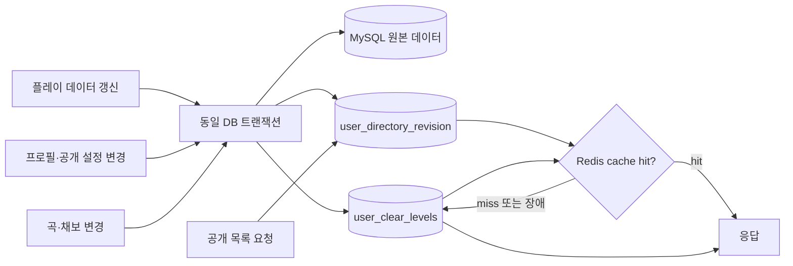

# 사용자 랭킹 API 성능 개선

- 상태: Accepted
- 적용일: 2026-09-04
- 대상: `GET /api/v1/users`, `GET /api/v1/users/rankings`
- 관련 변경: [PR #135](https://github.com/popngg/popngg/pull/135)
- 배포 검증: [GitHub Actions run 33781660852](https://github.com/popngg/popngg/actions/runs/33781660852)

## 요약

클리어 레벨로 사용자 목록을 정렬할 때 요청마다 전체 `playdata`를 집계하면서 응답시간이 약 17.3초까지 증가했다. 이로 인해 배포 smoke test의 10초 제한을 초과하고, 클라이언트 또는 프록시가 먼저 연결을 종료하면 `Broken pipe`가 발생할 가능성이 있었다.

요청 시점의 전체 집계를 사용자 갱신 시점의 사전 집계로 전환하고, 자주 조회되는 공개 목록 첫 페이지에는 Redis 캐시를 적용했다. 그 결과 캐시가 비어 있는 첫 조회는 약 0.74초, 반복 조회는 약 0.19초로 감소했다.

> 캐시를 먼저 추가하는 방식은 선택하지 않았다. Redis가 비었거나 무효화된 첫 요청에서도 10초 제한을 만족해야 하므로 DB 조회 경로를 먼저 개선하고 그 위에 캐시를 추가했다.

## 문제 발견

운영에서 다음 오류가 반복적으로 보고됐다.

```text
ServletOutputStream failed to flush: java.io.IOException: Broken pipe
GET /api/v1/users
```

`Broken pipe` 자체는 클라이언트가 먼저 연결을 닫았다는 의미이므로 서버 성능 문제를 단정할 수 없다. 따라서 `/users`의 정렬 조건별 응답시간을 분리해서 측정했다.

| 조회 조건 | 개선 전 응답시간 |
| --- | ---: |
| 기본 사용자 목록 | 약 0.7초 |
| 수정일 정렬 | 약 0.8초 |
| 클리어 레벨 정렬 | 약 17.3초 |

클리어 레벨 정렬에서만 대부분의 시간이 첫 바이트를 받기 전에 소비됐다. 이를 통해 네트워크 전송보다 DB 조회가 병목이라는 것을 확인했다.

## 원인

클리어 레벨은 사용자가 클리어한 채보 중 가장 높은 레벨이다. 기존 쿼리는 사용자 목록을 조회할 때마다 `playdata`와 `charts`를 결합하고 사용자별 `MAX(level)`을 계산했다.

사용자 수와 플레이 데이터가 증가할수록 목록 요청 한 번이 전체 플레이 데이터 집계를 유발했다. 첫 번째 최적화로 상관 서브쿼리를 요청당 한 번의 그룹 집계로 바꿨지만, 운영 데이터에서는 여전히 10초를 초과했다.

핵심 문제는 집계문의 모양보다 **변경 빈도가 낮은 값을 모든 읽기 요청에서 다시 계산하는 구조**였다.

## 설계



### 클리어 레벨 사전 집계

Flyway V21에서 `user_clear_levels`를 추가했다. 사용자별·게임 버전별 최고 클리어 레벨을 저장하며, 목록 조회는 전체 `playdata` 집계 대신 이 테이블을 `LEFT JOIN`한다.

집계 갱신 시점은 다음과 같다.

- 플레이 데이터 갱신 및 팝클래스 재계산: 해당 사용자만 재계산
- 곡·채보 레벨 변경: 전체 사용자 집계 재계산
- API 시작: 이전 애플리케이션으로 롤백된 동안의 변경과 직접 수행된 카탈로그 migration을 반영하기 위해 전체 집계 조정

### 공개 목록 Redis 캐시

캐시 대상은 재사용 가능성이 높고 개인정보가 포함되지 않는 조회로 제한했다.

- 검색어가 없는 사용자 목록 첫 페이지
- 사용자 랭킹 첫 페이지
- 정렬 기준, 정렬 방향, 페이지 크기, 게임 버전 및 revision을 캐시 키에 포함
- TTL 5분
- Redis 최대 데이터 메모리 128MB, `allkeys-lru` 정책
- 검색 결과, 후속 페이지, 개별 사용자 및 비공개 프로필은 캐시하지 않음

갱신 요청에서 동기적으로 캐시를 미리 채우지 않는다. 갱신은 원본 데이터와 집계 및 revision만 변경하고, 다음 읽기 요청이 캐시를 채운다. 이 방식은 갱신 응답시간과 캐시 의존성을 줄인다.

### revision 기반 무효화

Redis 키를 직접 삭제하는 방식 대신 MySQL의 `user_directory_revision` 값을 캐시 키에 포함했다. 목록 결과에 영향을 주는 쓰기는 원본 데이터와 같은 트랜잭션에서 revision을 증가시킨다.

이 구조가 해결하는 문제는 다음과 같다.

- DB 변경은 성공했지만 Redis 삭제가 실패하는 부분 실패
- 변경과 조회가 겹칠 때 이전 결과가 새 캐시로 저장되는 경쟁 상태
- 롤백될 데이터를 캐시에 공개하는 문제
- 여러 API 인스턴스 사이에서 무효화 신호가 달라지는 문제

이전 revision의 키는 즉시 전체 검색·삭제하지 않고 TTL과 LRU 정책에 따라 자연스럽게 제거한다.

### Redis 장애 격리

Redis는 원본 저장소가 아니라 선택적 성능 계층으로 취급한다.

- 연결 및 명령 timeout: 200ms
- 장애 시 MySQL 조회로 fallback
- 장애 감지 후 30초 동안 Redis 접근 유예
- Redis 상태를 API health 판정에서 제외
- `USER_DIRECTORY_CACHE_ENABLED=false`로 캐시만 비활성화 가능

따라서 Redis가 중단돼도 API는 사전 집계 테이블을 사용해 계속 응답할 수 있다.

## 검증 전략

### 자동화 검증

- H2에서 집계 조건과 트랜잭션 rollback 검증
- MySQL Testcontainers에서 실제 migration 및 동시 갱신 검증
- Redis Testcontainers에서 직렬화, TTL 및 eviction 후 재조회 검증
- Redis 연결 실패, 잘못된 캐시 값, revision 변경 및 DB 오류 전파 검증
- smoke script의 정상 응답, HTTP 503 및 10초 timeout 검증
- 배포 smoke test에서 최초 조회와 반복 조회를 별도로 수행

### 배포 관측성

배포 로그에 요청별 다음 정보를 기록하도록 변경했다.

- HTTP 상태 코드
- 첫 바이트까지 걸린 시간
- 전체 응답시간
- `curl` 종료 코드
- 클리어 레벨 최초 조회와 반복 조회 결과

시간 제한을 늘려 문제를 숨기지 않고 기존 10초 제한을 유지했다.

## 결과

외부 네트워크에서 운영 API를 순차 측정한 결과다.

| API | 개선 전 | 개선 후 첫 조회 | Redis 반복 조회 |
| --- | ---: | ---: | ---: |
| 클리어 레벨 정렬 | 약 17.3초 | 0.736초 | 0.190초 |
| 기본 사용자 목록 | 약 0.7초 | 0.780초 | 0.187초 |
| 사용자 랭킹 | 약 0.7초 | 0.760초 | 0.200초 |

클리어 레벨 첫 조회는 약 23배 빨라졌다. 배포 서버 내부 smoke test에서는 최초 조회 0.669초, 반복 조회 0.071초를 기록했다.

캐시를 준비한 뒤 동시 요청 5개로 API별 30회 요청한 결과는 다음과 같다.

| API | 성공 | 오류 | p50 | p95 | 최대 |
| --- | ---: | ---: | ---: | ---: | ---: |
| 클리어 레벨 정렬 | 30/30 | 0 | 0.157초 | 0.176초 | 0.186초 |
| 사용자 랭킹 | 30/30 | 0 | 0.160초 | 0.178초 | 0.184초 |

이는 제한된 운영 확인이며 최대 처리량을 찾는 부하 테스트는 아니다. 운영 데이터를 변경해야 하는 실제 갱신 직후 무효화, Redis 강제 중단 및 장시간 p99 측정은 별도 점검 대상으로 남긴다.

## 트레이드오프와 운영 기준

- 공개 목록에 영향을 주는 쓰기는 revision 행 잠금으로 직렬화된다. 현재 갱신 빈도에는 적합하지만 갱신량이 증가하면 쓰기 대기시간을 모니터링해야 한다.
- 곡·채보 변경은 사용자별 최고 레벨에 영향을 줄 수 있어 전체 집계를 다시 만든다. 카탈로그 변경 빈도가 높아지면 증분 재계산 범위를 좁혀야 한다.
- 캐시는 첫 페이지에 집중한다. 검색 또는 후속 페이지 트래픽이 증가하면 cardinality와 메모리 사용량을 측정한 뒤 확장한다.
- Flyway V21은 이전 `main` 애플리케이션과 함께 존재할 수 있는 additive migration이다. 롤백 시 테이블을 삭제하지 않는다.
- 구버전과 신버전 API writer를 동시에 운영하거나 서비스 중 원본 테이블을 직접 수정하지 않는다. 직접 변경 후에는 API를 재시작해 집계를 조정한다.

## 포트폴리오 요약

> 요청마다 전체 플레이 데이터를 집계하던 사용자 랭킹 API를 갱신 시점의 사전 집계와 revision 기반 Redis 캐시 구조로 개선했다. 캐시 미스 성능을 먼저 해결한 뒤 Redis를 선택적 계층으로 추가하여, 최악의 응답시간을 약 17.3초에서 0.74초로 줄이고 Redis 장애 시에도 MySQL fallback으로 서비스를 유지하도록 설계했다. 성능 기준을 배포 smoke test에 포함해 회귀를 자동으로 감지할 수 있게 했다.
