# MVP DB 설계 초안

이 문서는 빠른 MVP 출시를 목표로 한 신규 DB 설계 초안입니다. 원칙은 단순합니다.

- 사용자에게 익숙한 공개 화면 흐름은 유지하되, 내부 구조는 새 기준으로 설계합니다.
- `song`과 `chart`는 분리합니다.
- DB foreign key constraint는 만들지 않습니다.
- 대신 id 컬럼, unique key, index, 애플리케이션 검증으로 정합성을 유지합니다.
- 랭크는 점수로 계산하지 않고 크롤링된 값을 저장합니다.
- 확장 기능은 막지 않되, MVP에서 당장 필요하지 않은 테이블은 뒤로 미룹니다.

## MVP 범위

### 포함

- 유저 등록/갱신/로그인
- 이메일 기반 비밀번호 복구
- 곡/채보 조회
- 플레이데이터 갱신
- 유저별 전체 플레이데이터
- 유저 팝클 테이블
- 곡별 랭킹
- 레벨별 랭크/메달 집계
- 갱신 로그
- 플레이데이터 히스토리

### MVP 이후

- 곡 검색 태그 기여
- 한국어 검색 태그 승인 플로우
- 이메일 인증
- 상세 모니터링 테이블
- 관리자 데이터 검수 UI
- 게임 코드/표시 정책 DB 관리 UI

## 테이블 요약

MVP에서는 다음 테이블을 제안합니다.

| 테이블 | 역할 | 레거시 대응 |
| --- | --- | --- |
| `users` | 유저 계정, 인증, 권한 | `"user"` 일부 |
| `user_profiles` | 공개 프로필, 랭킹 표시 캐시, credit | `"user"` 일부 |
| `songs` | 곡 단위 메타데이터 | `chart` 일부 |
| `song_search_tags` | 곡 검색용 태그/별칭 | 신규 |
| `charts` | 난이도별 채보 메타데이터 | `chart` 일부 |
| `game_version_transitions` | 게임 버전 전환 시 점수 초기화/승계 정책 | 신규 |
| `playdata` | 유저별 채보 베스트 플레이데이터. 버전 베스트와 역대 베스트를 구분 | `playdata` |
| `playdata_history` | 플레이데이터 변경 이력 | `history` |
| `renew_logs` | 갱신/등록 로그 | `renew_log` |
| `login_logs` | 로그인 로그 | `login_log` |
| `password_reset_tokens` | 이메일 기반 비밀번호 복구 토큰 | 신규 |

MVP에서는 `rank_policy`, `medal_policy`, `difficulty_policy`를 별도 테이블로 만들지 않고 애플리케이션 코드의 enum/policy object로 둡니다. 여기서 말하는 정책은 랭크/메달/난이도 같은 게임 코드와 화면 표시명을 관리하는 기준입니다. 버전별 정책 변경을 코드로 감당하기 어려워지거나 운영자가 화면에서 수정해야 하는 시점에 테이블로 승격합니다.

## ERD

MVP DB 구조를 읽기 쉽게 그리면 다음과 같습니다.

DB foreign key constraint는 만들지 않지만, 아래 관계는 애플리케이션에서 보장해야 하는 참조 관계입니다.

```mermaid
erDiagram
    USERS {
        bigint user_id PK
        varchar poptomo_id UK
        varchar password_hash
        varchar email UK
        datetime email_verified_at
        varchar role
        datetime created_at
        datetime updated_at
    }

    USER_PROFILES {
        bigint user_id PK
        varchar user_name
        varchar character_name
        varchar comment
        varchar profile_image_url
        boolean is_hidden
        int display_popclass
        int potential_popclass
        int legacy_popclass
        int normal_credit
        int extra_credit
        int time_play_10_credit
        int time_play_16_credit
        datetime created_at
        datetime updated_at
    }

    SONGS {
        bigint song_id PK
        char song_hash
        varchar genre_name
        varchar song_name
        varchar artist_name
        int version
        varchar jacket_url
        datetime created_at
        datetime updated_at
    }

    CHARTS {
        bigint chart_id PK
        bigint song_id
        tinyint difficulty_code
        varchar difficulty_label
        tinyint level
        int chart_version
        boolean has_strict_judgement
        boolean has_strict_gauge
        boolean is_upper
        boolean is_deleted
        datetime created_at
        datetime updated_at
    }

    SONG_SEARCH_TAGS {
        bigint tag_id PK
        bigint song_id
        varchar tag_value
        varchar normalized_tag_value
        varchar tag_type
        varchar source
        boolean is_active
        datetime created_at
        datetime updated_at
    }

    GAME_VERSION_TRANSITIONS {
        bigint transition_id PK
        int from_version
        int to_version
        varchar score_policy
        varchar status
        bigint created_by
        datetime applied_at
        datetime created_at
        datetime updated_at
    }

    PLAYDATA {
        bigint playdata_id PK
        bigint user_id
        bigint chart_id
        int current_version
        int version_score
        tinyint version_rank_code
        int all_time_score
        int all_time_score_version
        tinyint all_time_rank_code
        tinyint medal_code
        int popclass
        boolean is_display_popclass_target
        varchar popclass_bucket
        int popclass_bucket_rank
        datetime last_played_at
        datetime created_at
        datetime updated_at
    }

    PLAYDATA_HISTORY {
        bigint history_id PK
        bigint user_id
        bigint chart_id
        int game_version
        int previous_version_score
        int version_score
        int previous_all_time_score
        int all_time_score
        tinyint previous_rank_code
        tinyint rank_code
        tinyint previous_medal_code
        tinyint medal_code
        varchar event_type
        int popclass
        bigint renew_log_id
        datetime created_at
    }

    RENEW_LOGS {
        bigint renew_log_id PK
        varchar poptomo_id
        bigint user_id
        varchar status
        varchar mode
        int input_chart_count
        int matched_chart_count
        int updated_playdata_count
        varchar failure_reason
        varchar ip
        datetime created_at
    }

    LOGIN_LOGS {
        bigint login_log_id PK
        varchar poptomo_id
        bigint user_id
        varchar status
        varchar failure_reason
        varchar ip
        datetime created_at
    }

    PASSWORD_RESET_TOKENS {
        bigint reset_token_id PK
        bigint user_id
        char token_hash UK
        varchar email
        datetime expires_at
        datetime used_at
        varchar requested_ip
        datetime created_at
    }

    SONGS ||--o{ CHARTS : "has charts"
    SONGS ||--o{ SONG_SEARCH_TAGS : "has search tags"
    USERS ||--|| USER_PROFILES : "has public profile"
    USERS ||--o{ PLAYDATA : "has scoped best playdata"
    CHARTS ||--o{ PLAYDATA : "is played as"
    USERS ||--o{ PLAYDATA_HISTORY : "has history"
    CHARTS ||--o{ PLAYDATA_HISTORY : "records history"
    USERS ||--o{ PASSWORD_RESET_TOKENS : "requests reset"
    USERS ||--o{ RENEW_LOGS : "has renew logs"
    USERS ||--o{ LOGIN_LOGS : "has login logs"
```



### 관계 요약

| 관계 | 의미 | DB FK |
| --- | --- | --- |
| `users 1:1 user_profiles` | 계정 정보와 공개 프로필/랭킹 표시 캐시를 분리합니다. | 없음 |
| `songs 1:N charts` | 한 곡은 여러 난이도 채보를 가집니다. | 없음 |
| `songs 1:N song_search_tags` | 한 곡은 여러 검색 태그/별칭을 가질 수 있습니다. | 없음 |
| `users 1:N playdata` | 한 유저는 여러 채보의 현재 플레이 상태를 가집니다. | 없음 |
| `charts 1:N playdata` | 한 채보는 여러 유저의 플레이 상태를 가집니다. | 없음 |
| `users + charts -> playdata unique` | 유저별 채보의 현재 상태 row는 하나만 존재합니다. | unique key |
| `users 1:N playdata_history` | 유저의 변경 이력을 저장합니다. | 없음 |
| `charts 1:N playdata_history` | 채보별 변경 이력을 추적할 수 있습니다. | 없음 |
| `users 1:N password_reset_tokens` | 이메일 비밀번호 복구 토큰을 저장합니다. | 없음 |
| `users 1:N renew_logs/login_logs` | 갱신/로그인 시도 추적용입니다. | 없음 |

## users

기존 `"user"`는 예약어 회피가 번거로우므로 `users`로 바꿉니다. 신규 구조에서는 `users`를 계정/인증/권한 테이블로 제한하고, 공개 화면에 필요한 프로필과 게임 표시 캐시는 `user_profiles`로 분리합니다.

이 분리는 3테이블 구조(`users`, `user_profiles`, `user_game_stats`)보다 단순하면서도, 단일 `users` 테이블보다 보안 경계를 선명하게 만들기 위한 절충안입니다.

| 컬럼 | 타입 | 제약 | 설명 |
| --- | --- | --- | --- |
| `user_id` | BIGINT | PK, auto increment | 내부 id |
| `poptomo_id` | VARCHAR(32) | NOT NULL, UNIQUE | 외부 유저 식별자 |
| `password_hash` | VARCHAR(255) | NOT NULL | 해싱된 비밀번호 |
| `email` | VARCHAR(255) | NULL, UNIQUE | 비밀번호 복구용 이메일 |
| `email_verified_at` | DATETIME | NULL | 이메일 인증 완료 시각 |
| `role` | VARCHAR(20) | NOT NULL DEFAULT 'USER' | `USER`, `ADMIN`, `BOT` |
| `created_at` | DATETIME | NOT NULL | 생성일 |
| `updated_at` | DATETIME | NOT NULL | 수정일 |

### 인덱스

| 인덱스 | 목적 |
| --- | --- |
| unique `poptomo_id` | 로그인/프로필/갱신 대상 조회 |
| unique `email` | 비밀번호 복구 대상 조회 |
| `role` | 관리자/BOT 계정 필터 |

### 계정 정책

- `users`는 password, email, role처럼 보안과 인증에 직접 관련된 값만 소유합니다.
- 공개 프로필 조회와 랭킹 조회는 가능한 한 `user_profiles` 중심 projection으로 처리하고, `users`에서는 `poptomo_id`, `role`처럼 필요한 최소 필드만 붙입니다.
- 유저 생성 시 `users`와 `user_profiles` row를 같은 transaction에서 함께 생성합니다.
- DB foreign key constraint는 두지 않지만, `user_profiles.user_id`는 반드시 존재하는 `users.user_id`와 1:1로 유지합니다.

## user_profiles

공개 프로필, 랭킹 표시 캐시, 게임 갱신으로 바뀌는 credit을 저장합니다.

`character_name`은 갱신 때 함께 바뀔 수 있지만, 성격상 게임 통계 수치라기보다 프로필/랭킹에 표시되는 공개 정보이므로 `user_profiles`에 둡니다. `display_popclass`, `potential_popclass`, credit도 화면에서 프로필 정보와 함께 쓰이므로 MVP에서는 별도 `user_game_stats`로 쪼개지 않습니다.

| 컬럼 | 타입 | 제약 | 설명 |
| --- | --- | --- | --- |
| `user_id` | BIGINT | PK | `users.user_id`와 1:1로 대응하는 내부 id |
| `user_name` | VARCHAR(64) | NOT NULL | 유저명 |
| `character_name` | VARCHAR(128) | NOT NULL DEFAULT '' | 캐릭터 |
| `comment` | VARCHAR(255) | NOT NULL DEFAULT '' | 코멘트 |
| `profile_image_url` | VARCHAR(512) | NULL | 프로필 이미지 URL 또는 key |
| `is_hidden` | BOOLEAN | NOT NULL DEFAULT FALSE | 비공개 여부 |
| `display_popclass` | INT | NOT NULL DEFAULT 0 | 현재 서비스 표기용 팝클. 기본은 현재 버전 `version_score` 기준 |
| `potential_popclass` | INT | NOT NULL DEFAULT 0 | 최고 기록 기준으로 산출한 포텐셜 팝클래스. `all_time_score` 기준 |
| `legacy_popclass` | INT | NOT NULL DEFAULT 0 | 28버전 이전 기준 팝클. 기존 DB 마이그레이션 값 보존 |
| `normal_credit` | INT | NOT NULL DEFAULT 0 | `NORMAL` credit |
| `extra_credit` | INT | NOT NULL DEFAULT 0 | `EXTRA` credit |
| `time_play_10_credit` | INT | NOT NULL DEFAULT 0 | `TIME PLAY(10분)` credit |
| `time_play_16_credit` | INT | NOT NULL DEFAULT 0 | `TIME PLAY(16분)` credit |
| `created_at` | DATETIME | NOT NULL | 생성일 |
| `updated_at` | DATETIME | NOT NULL | 수정일 |

### 인덱스

| 인덱스 | 목적 |
| --- | --- |
| `display_popclass desc` | 현재 표기 기준 유저 랭킹 |
| `potential_popclass desc` | 최고 기록 기준 포텐셜 랭킹 |
| `legacy_popclass desc` | 28버전 이전 기준 보존/비교 |
| `is_hidden`, `display_popclass desc` | 비공개 유저 제외 랭킹 |

### 팝클래스 정책

`user_profiles`는 화면과 랭킹에서 자주 쓰는 유저 단위 팝클 값을 캐시합니다. High☆Cheers부터 점수와 팝클 기준이 버전별로 갈라지므로 단일 `popclass` 컬럼으로는 부족합니다.

| 컬럼 | 계산 기준 | 용도 |
| --- | --- | --- |
| `display_popclass` | 현재 서비스가 표기하는 기준. MVP에서는 현재 버전 `version_score` 상위 50개 | 유저 프로필, 기본 랭킹 |
| `potential_popclass` | 최고 기록 기준. `all_time_score` 상위 50개 | 포텐셜 팝클래스, 장기 실력 지표 |
| `legacy_popclass` | 28버전 이전 기존 기준 | 마이그레이션 값 보존, 이전 시즌 비교 |

갱신 정책:

- 현재 버전 score 갱신 후 `display_popclass`를 재계산합니다.
- `all_time_score`가 갱신되면 `potential_popclass`도 반드시 재계산합니다.
- 기존 DB 마이그레이션 시 기존 `"user".popclass`는 `user_profiles.legacy_popclass`에 보존합니다.
- 마이그레이션 시 기존 playdata를 `all_time_score`로 넣은 뒤, 초기 `potential_popclass`를 반드시 한 번 계산해 채웁니다.
- 마이그레이션 중 계산식 검증이 끝나지 않았다면 기존 `"user".popclass`를 임시 복사할 수 있지만, 전환 완료 전 재계산 결과로 덮어써야 합니다.

### 이메일 정책

- 이메일은 MVP에서 비밀번호 복구용으로 사용합니다.
- 기존 유저 중 이메일이 없는 유저는 로그인 후 이메일 등록을 유도합니다.
- 이메일 인증 전에도 저장은 가능하지만, 비밀번호 복구 메일 발송을 `email_verified_at`이 있는 계정으로 제한할지는 회의에서 확정합니다.
- 보수적인 기본 후보는 인증된 이메일만 복구에 사용하는 것입니다.
- MVP 1차에서 인증 플로우를 늦춘다면, 이메일 등록 즉시 복구를 허용하는 대신 rate limit, 감사 로그, 안내 문구를 함께 둡니다.

### Credit 정책

High☆Cheers 기준 credit 종류는 기존 `normal/battle/local`이 아니라 다음 4종입니다.

| 컬럼 | 게임 표시 |
| --- | --- |
| `normal_credit` | `NORMAL` |
| `extra_credit` | `EXTRA` |
| `time_play_10_credit` | `TIME PLAY(10分)` |
| `time_play_16_credit` | `TIME PLAY(16分)` |

기존 DB의 `normal_credit`, `battle_credit`, `local_credit`은 신규 credit 체계와 1:1 매핑하지 않습니다. 데이터 마이그레이션에서는 기존 코인수를 이어받지 않고 신규 4종 credit을 모두 0으로 초기화합니다.

갱신/크롤링 입력도 신규 4종 credit 이름으로 받습니다. 이전 `battle/local` 이름을 신규 API에 유지하지 않습니다.

## songs

곡 단위 메타데이터입니다. 기존 `chart`에 중복 저장되던 곡 정보를 분리합니다.

| 컬럼 | 타입 | 제약 | 설명 |
| --- | --- | --- | --- |
| `song_id` | BIGINT | PK, auto increment | 내부 id |
| `song_hash` | CHAR(32) | NULL, UNIQUE 후보 | 외부/API 식별자 후보. seed 정책 확정 후 `NOT NULL`, `UNIQUE` 적용 |
| `genre_name` | VARCHAR(255) | NOT NULL | High☆Cheers 기준 장르명 |
| `song_name` | VARCHAR(255) | NOT NULL | 곡명 |
| `artist_name` | VARCHAR(255) | NULL | 작곡가/아티스트. MVP 마이그레이션 때 없으면 null |
| `version` | INT | NOT NULL | 원곡 또는 곡 그룹의 최초 수록 버전 |
| `jacket_url` | VARCHAR(512) | NULL | 자켓 URL 또는 key |
| `created_at` | DATETIME | NOT NULL | 생성일 |
| `updated_at` | DATETIME | NOT NULL | 수정일 |

### song_hash 정책

이 항목은 아직 확정되지 않았습니다. 현재는 후보를 비교하는 단계입니다.

- 후보 A: `genreName + songName + artistName + version + upperGroupPolicy`
- 후보 B: `songName + artistName + version + upperGroupPolicy`
- 후보 C: `genreName + songName + version + upperGroupPolicy`

주의:

- 장르명과 제목은 더 이상 불변값으로 보지 않습니다. 기존 데이터에서 장르명이 없는 곡은 제목과 같은 문자열을 장르명에 넣어왔으므로, 장르명 자체를 안정적인 식별자로 보지 않습니다.
- `isUpper`와 `chartVersion`을 hash seed에 넣을지 여부는 회의에서 확정합니다.
- 기본 방향은 Upper를 별도 song으로 나누지 않고 같은 song의 chart 속성으로 두는 쪽이지만, 최종 결정은 후보 비교 후 확정합니다.
- 기존 hash와 신규 hash 매핑은 마이그레이션 산출물로 남길 수 있게 준비합니다.
- seed 정책 확정 전에는 `song_hash`를 스키마의 hard unique 기준으로 사용하지 않습니다.
- 후보 검증이 끝나면 migration에서 `song_hash`를 backfill하고 `NOT NULL`, `UNIQUE` 제약을 적용합니다.
- `song_hash`가 바뀔 수 있으므로 `playdata`, `playdata_history`, jacket/image, 검색 index, cache는 `song_hash`가 아니라 `song_id` 또는 `chart_id`를 기준으로 연결합니다.
- 곡 메타데이터 변경 API는 `song_id`로 대상을 지정하고, 변경 결과로 songhash가 바뀌면 old/new mapping 또는 alias를 남깁니다.
- 레거시 S3 자켓 key가 기존 `songHash`를 사용했으므로, 마이그레이션 시 기존 key를 rename하지 않고 신규 `song_hash` 기반 key로 copy/upload한 뒤 `jacket_url` 참조를 전환합니다.
- 추후 `song_hash`가 변경되는 곡도 자켓을 신규 key에 새로 저장하고, 기존 key는 검증/롤백 기간 이후 정리합니다.

자켓 key 후보:

```text
jackets/{songHash}.png
```

주의: 내부 참조는 여전히 `song_id`가 기준입니다. `songHash` 기반 자켓 key는 외부 정적 asset key 또는 호환 목적의 파생값으로만 다룹니다.

### 인덱스

| 인덱스 | 목적 |
| --- | --- |
| unique `song_hash` 후보 | 외부/API 조회. seed 정책 확정과 backfill 이후 적용 |
| `version`, `song_name` | 원곡 수록 버전 기준 곡 목록 정렬 |
| `genre_name`, `song_name` | 기본 검색 |
| `song_name` | 곡명 검색 |

## song_search_tags

곡 검색용 태그/별칭입니다. 공식 곡명, 장르명, 아티스트명만으로 찾기 어려운 검색어를 별도 테이블로 관리합니다.

예를 들어 `moonchild`라는 곡을 사용자가 `문차일드`로 검색할 수 있게 하려면 다음과 같은 tag를 저장합니다.

| 컬럼 | 타입 | 제약 | 설명 |
| --- | --- | --- | --- |
| `tag_id` | BIGINT | PK, auto increment | 내부 id |
| `song_id` | BIGINT | NOT NULL | 대상 곡 id |
| `tag_value` | VARCHAR(255) | NOT NULL | 검색어 원문. 예: `문차일드` |
| `normalized_tag_value` | VARCHAR(255) | NOT NULL | 검색용 정규화 값 |
| `tag_type` | VARCHAR(32) | NOT NULL | `KOREAN_ALIAS`, `ROMANIZED`, `ABBREVIATION`, `COMMUNITY`, `ADMIN` 등 |
| `source` | VARCHAR(32) | NOT NULL | `ADMIN`, `MIGRATION`, `USER_SUGGESTION` 등 |
| `is_active` | BOOLEAN | NOT NULL | 검색 반영 여부 |
| `created_at` | DATETIME | NOT NULL | 생성일 |
| `updated_at` | DATETIME | NOT NULL | 수정일 |

정책:

- `song_search_tags`는 검색용 alias이며 공식 표시명은 아닙니다.
- 같은 곡에 같은 normalized tag가 중복 등록되지 않게 합니다.
- MVP에서는 관리자 또는 seed/migration으로만 등록합니다.
- 유저가 태그를 제안하고 관리자가 승인하는 플로우는 MVP 이후 기능으로 둡니다.
- Redis 검색 read model은 `songs`, `charts`, `song_search_tags`를 조합해 생성합니다.

### 인덱스

| 인덱스 | 목적 |
| --- | --- |
| `normalized_tag_value`, `is_active` | 태그 검색 |
| unique `song_id`, `normalized_tag_value`, `tag_type` | 같은 곡의 중복 태그 방지 |

## charts

난이도별 채보 메타데이터입니다.

| 컬럼 | 타입 | 제약 | 설명 |
| --- | --- | --- | --- |
| `chart_id` | BIGINT | PK, auto increment | 내부 id |
| `song_id` | BIGINT | NOT NULL | `songs.song_id`를 가리키는 애플리케이션 참조 |
| `difficulty_code` | TINYINT | NOT NULL | `1~4`, MVP에서는 기존 코드 유지 |
| `difficulty_label` | VARCHAR(16) | NOT NULL | `LIGHT`, `NORMAL`, `HYPER`, `EX` |
| `level` | TINYINT | NOT NULL | 레벨 |
| `chart_version` | INT | NOT NULL | 해당 채보가 등장한 게임 버전. 일반 채보는 대개 `songs.version`과 같지만 Upper는 다를 수 있음 |
| `has_strict_judgement` | BOOLEAN | NOT NULL DEFAULT FALSE | 짠판정 여부 |
| `has_strict_gauge` | BOOLEAN | NOT NULL DEFAULT FALSE | 짠게이지 여부 |
| `is_upper` | BOOLEAN | NOT NULL DEFAULT FALSE | Upper 여부. 표시 딱지는 제거해도 데이터는 보존 |
| `is_deleted` | BOOLEAN | NOT NULL DEFAULT FALSE | 삭제 여부 |
| `created_at` | DATETIME | NOT NULL | 생성일 |
| `updated_at` | DATETIME | NOT NULL | 수정일 |

팝픈은 곡 또는 채보마다 짠판정, 짠게이지 특성이 존재합니다. 특히 짠게이지는 노트 수가 1536개를 넘는 채보에서 적용되므로 같은 곡이라도 높은 난이도 채보만 짠게이지일 수 있습니다. 따라서 MVP에서는 곡 단위인 `songs`가 아니라 난이도별 채보 단위인 `charts`에 `has_strict_gauge`를 둡니다.

`has_strict_judgement`도 난이도별 차이가 발생할 가능성을 열어두기 위해 `charts`에 둡니다. 실제 데이터가 곡 단위로만 존재한다고 확인되면 API 응답에서 곡 단위 요약값으로 집계할 수 있습니다.

`chart_version`은 팝클의 이번 버전곡/구곡 bucket 판정에도 사용합니다. 같은 `song`이라도 Upper가 나중 버전에 추가될 수 있으므로, 현재 버전 신곡 여부를 `songs.version`만으로 판단하면 Upper 채보가 잘못 분류될 수 있습니다.

### 인덱스

| 인덱스 | 목적 |
| --- | --- |
| unique `song_id`, `difficulty_code`, `is_upper` | 곡별 일반/Upper 난이도 중복 방지 |
| `level`, `is_deleted` | 레벨별 목록/집계 |
| `difficulty_code`, `level` | 난이도/레벨 필터 |
| `song_id`, `is_deleted` | 곡 상세에서 채보 목록 조회 |
| `chart_version`, `is_upper` | 버전별 채보/Upper 필터 |

## playdata

유저별 채보의 **현재 상태**를 저장하는 테이블입니다. `playdata`는 계속 쌓는 테이블이 아니라 `user_id + chart_id`당 하나의 row만 유지하고, 기록이 갱신되거나 메달이 바뀌면 이 row를 수정합니다.

점수와 메달은 생명주기가 다릅니다.

- 점수는 버전 전환 정책에 따라 현재 버전 점수가 0점부터 다시 시작하거나 이전 버전 점수를 승계할 수 있습니다.
- 메달은 버전이 바뀌어도 유지됩니다.
- 따라서 `version_score = 0`이면서 `medal_code = 다이아 클리어` 같은 상태는 정상 데이터입니다.

과거 버전별 베스트와 성장 추이는 `playdata_history`에 남깁니다. `playdata`는 화면과 랭킹에서 가장 자주 필요한 현재 버전 점수, 역대 최고 점수, 유지 메달을 빠르게 읽기 위한 current state table입니다.

핵심 개념:

| 개념 | 설명 |
| --- | --- |
| 현재 버전 점수 | `current_version`에 해당하는 점수. 버전 전환 정책에 따라 초기화하거나 승계합니다. |
| 역대 최고 점수 | 전체 버전 중 가장 높은 점수. 점수가 나온 버전은 `all_time_score_version`에 저장합니다. |
| 유지 메달 | 버전이 바뀌어도 유지되는 클리어 메달 상태입니다. |
| 성장 이력 | 기록 갱신, 메달 변경, 버전 초기화/승계 같은 의미 있는 변화만 `playdata_history`에 append합니다. |

예:

| 상황 | current_version | version_score | all_time_score | all_time_score_version | medal_code |
| --- | --- | --- | --- | --- | --- |
| 28버전에서 95,000점 다이아 클리어 | 28 | 95000 | 95000 | 28 | 다이아 |
| 29버전 첫 갱신, `RESET`, 메달 유지 | 29 | 0 | 95000 | 28 | 다이아 |
| 29버전에서 91,000점 기록 | 29 | 91000 | 95000 | 28 | 다이아 |
| 29버전에서 96,000점 기록 | 29 | 96000 | 96000 | 29 | 다이아 |
| 30버전 전환, `CARRY_OVER` | 30 | 96000 | 96000 | 29 | 다이아 |

| 컬럼 | 타입 | 제약 | 설명 |
| --- | --- | --- | --- |
| `playdata_id` | BIGINT | PK, auto increment | 내부 id |
| `user_id` | BIGINT | NOT NULL | `users.user_id`를 가리키는 애플리케이션 참조 |
| `chart_id` | BIGINT | NOT NULL | `charts.chart_id`를 가리키는 애플리케이션 참조 |
| `current_version` | INT | NOT NULL | 현재 버전 점수의 대상 게임 버전 |
| `version_score` | INT | NOT NULL DEFAULT 0 | 현재 버전 최고 점수 |
| `version_rank_code` | TINYINT | NULL | 현재 버전 점수에 대응하는 랭크. 점수 0이면 null 가능 |
| `all_time_score` | INT | NOT NULL DEFAULT 0 | 역대 최고 점수 |
| `all_time_score_version` | INT | NOT NULL | 역대 최고 점수가 나온 게임 버전. 없으면 `0` |
| `all_time_rank_code` | TINYINT | NULL | 역대 최고 점수에 대응하는 랭크 |
| `medal_code` | TINYINT | NOT NULL | 버전을 넘어 유지되는 현재 클리어 메달 |
| `popclass` | INT | NOT NULL DEFAULT 0 | 현재 버전 점수 기준 채보 팝클 |
| `is_display_popclass_target` | BOOLEAN | NOT NULL DEFAULT FALSE | 현재 표기 팝클 산정 대상 여부 |
| `popclass_bucket` | VARCHAR(20) | NULL | `CURRENT_VERSION`, `OLD_VERSION`. 산정 대상이 아니면 null |
| `popclass_bucket_rank` | INT | NULL | bucket 안에서의 순위. 현재 버전 1~20, 구곡 1~40 |
| `last_played_at` | DATETIME | NULL | 원천 데이터에서 플레이일을 얻을 수 있으면 저장 |
| `last_renew_log_id` | BIGINT | NULL | 마지막으로 이 row를 변경한 갱신 로그 id |
| `created_at` | DATETIME | NOT NULL | 생성일 |
| `updated_at` | DATETIME | NOT NULL | 수정일 |

### 중요 정책

- `rank_code`는 서버가 `score`로 계산하지 않습니다.
- 갱신/크롤링 입력에 현재 관측된 `score`, `rank_code`, `medal_code`가 함께 들어와야 합니다.
- 크롤링한 점수는 무조건 현재 게임 버전 점수로 간주합니다.
- 현재 게임 버전이 바뀌면 `game_version_transitions.score_policy`를 먼저 확인합니다.
- `score_policy = RESET`이면 `version_score`는 0 또는 관측된 현재 버전 점수로 초기화하고, `VERSION_INITIALIZED` 이력을 남깁니다.
- `score_policy = CARRY_OVER`이면 기존 `version_score`를 새 버전의 시작 점수로 승계하고, `VERSION_CARRIED_OVER` 이력을 남깁니다.
- `all_time_score`는 현재 관측 점수가 기존 역대 최고보다 높을 때만 갱신합니다.
- `medal_code`는 점수 상승이 없어도 관측 값이 바뀌면 갱신합니다.
- `popclass`는 현재 버전 `version_score`, `medal_code`, chart level 기준으로 계산합니다.
- `user_profiles.display_popclass`는 현재 버전 `version_score` 상위 50개 기준으로 계산합니다.
- `user_profiles.potential_popclass`는 `all_time_score` 상위 50개 기준으로 계산합니다.
- 기록 갱신, 메달 변경, 버전 초기화/승계가 발생하면 `playdata_history`를 append합니다.

## game_version_transitions

게임 버전이 올라갈 때 점수가 항상 초기화된다고 가정하지 않기 위한 운영 정책 테이블입니다. High☆Cheers처럼 `28 -> 29`에서는 점수가 초기화될 수 있지만, 이후 `29 -> 30`에서는 KONAMI 정책에 따라 기록이 유지될 수도 있습니다.

이 테이블은 “현재 서버 버전이 무엇인가”를 저장하는 테이블이 아니라, **버전 전환 시 기존 `playdata.version_score`를 어떻게 다룰지**를 선언합니다.

| 컬럼 | 타입 | 제약 | 설명 |
| --- | --- | --- | --- |
| `transition_id` | BIGINT | PK, auto increment | 내부 id |
| `from_version` | INT | NOT NULL | 이전 게임 버전 |
| `to_version` | INT | NOT NULL | 신규 게임 버전 |
| `score_policy` | VARCHAR(20) | NOT NULL | `RESET`, `CARRY_OVER` |
| `status` | VARCHAR(20) | NOT NULL | `DRAFT`, `APPLIED`, `CANCELLED` |
| `created_by` | BIGINT | NULL | 정책을 등록한 관리자 id |
| `memo` | VARCHAR(512) | NULL | 전환 근거 또는 회의 메모 |
| `applied_at` | DATETIME | NULL | 실제 적용 시각 |
| `created_at` | DATETIME | NOT NULL | 생성일 |
| `updated_at` | DATETIME | NOT NULL | 수정일 |

정책:

- `RESET`: 신규 버전 점수를 0부터 시작합니다. 첫 갱신에서 관측 점수가 있으면 그 값을 새 `version_score` 후보로 처리합니다.
- `CARRY_OVER`: 이전 버전의 `version_score`를 신규 버전의 시작 점수로 그대로 가져갑니다.
- `all_time_score`와 `medal_code`는 두 정책 모두에서 유지합니다.
- 전환 정책은 운영자가 관리자 API로 먼저 등록하고, 적용 job이 chunk 단위로 `playdata.current_version`을 갱신합니다.
- 적용 job을 돌리지 못한 row가 있더라도 갱신 API가 같은 정책을 lazy fallback으로 적용할 수 있어야 합니다.

추천 운영 방식:

1. 신규 버전이 확인되면 관리자 또는 운영자가 `game_version_transitions`에 `DRAFT` 정책을 등록합니다.
2. 실제 게임 데이터에서 점수 초기화 여부를 확인합니다.
3. 정책을 `RESET` 또는 `CARRY_OVER`로 확정합니다.
4. 관리자 적용 API 또는 Jenkins job으로 `playdata`를 chunk 단위 전환합니다.
5. 전환 결과와 영향 row 수를 로그로 남기고, `playdata_history`에 `VERSION_INITIALIZED` 또는 `VERSION_CARRIED_OVER` 이벤트를 기록합니다.

### 팝클 산정 대상 마킹

팝클표 조회 성능을 위해 서버는 현재 표기 팝클에 들어가는 `playdata` row를 미리 마킹합니다.

현재 표기 팝클은 다음 구성으로 계산합니다.

| bucket | 대상 | 개수 |
| --- | --- | --- |
| `CURRENT_VERSION` | 이번 버전에 등장한 채보의 `version_score`. `charts.chart_version = currentVersion` 기준 | 20개 |
| `OLD_VERSION` | 이전 버전에 등장한 채보의 `version_score`. `charts.chart_version < currentVersion` 기준 | 40개 |

정책:

- 크롤러는 `popclass_bucket`을 보내지 않습니다.
- 크롤러는 원천 데이터인 score/rank/medal/chart 식별자만 보냅니다.
- 서버가 playdata 갱신 후 유저 전체 현재 버전 `version_score`를 조회해 bucket을 재계산합니다.
- 서버는 기존 마킹을 초기화한 뒤 상위 20/40개 row에만 `is_display_popclass_target = true`를 설정합니다.
- `popclass_bucket_rank`는 각 bucket 안에서 `1`부터 시작합니다.
- `display_popclass`는 마킹된 row를 기준으로 계산합니다.
- `potential_popclass`는 `all_time_score` 기준이므로 이 마킹 필드를 사용하지 않고 별도 계산합니다.
- 갱신 도중 마킹 재계산이 실패하면 해당 갱신 job은 성공으로 처리하지 않습니다.

### 인덱스

`playdata`는 서비스에서 가장 자주 읽히는 테이블입니다. 다만 `user_id + chart_id`당 1 row만 유지하므로, 스코프별 row를 쌓는 구조보다 row 수가 예측 가능합니다.

```text
예: 유저 10,000명 * 채보 6,000개
= 최대 60,000,000 row 후보
```

따라서 `playdata` 조회는 항상 다음 원칙을 따릅니다.

1. `playdata`에서 `user_id`, `chart_id`, `current_version`으로 먼저 row를 줄입니다.
2. 줄어든 row에만 `charts`, `songs`, `users`를 join합니다.
3. 목록/집계 화면이 커지면 정규화 테이블을 계속 join하지 않고 read summary table을 추가합니다.

| 인덱스 | 목적 |
| --- | --- |
| unique `user_id`, `chart_id` | 유저별 채보 current state 단일화 |
| `user_id`, `current_version`, `popclass desc`, `version_score desc` | 현재 버전 팝클 상위 50 |
| `user_id`, `current_version`, `chart_id` | 유저별 현재 버전 플레이데이터 목록 |
| `chart_id`, `current_version`, `version_score desc` | 곡별 현재 버전 랭킹 |
| `chart_id`, `all_time_score desc` | 곡별 역대 랭킹 |
| `chart_id`, `medal_code`, `version_score desc` | 곡별 메달 우선 랭킹 |
| `user_id`, `current_version`, `version_rank_code` | 유저 rank 집계 |
| `user_id`, `medal_code` | 유저 medal 집계 |
| `user_id`, `current_version`, `is_display_popclass_target`, `popclass_bucket`, `popclass_bucket_rank` | 팝클표 빠른 조회 |

### 조회 패턴과 설계 근거

인덱스는 컬럼마다 무작정 추가하지 않습니다. 실제 API가 사용하는 `WHERE`, `ORDER BY`, `LIMIT` 패턴에 맞춰 최소한으로 둡니다.

#### 갱신/upsert

갱신 코드는 한 유저의 한 채보에 대해 `playdata` current state row 하나를 조회하고, 변화가 있을 때만 수정합니다.

```sql
SELECT *
FROM playdata
WHERE user_id = ?
  AND chart_id = ?;
```

이 쿼리는 다음 unique key로 처리합니다.

```sql
UNIQUE KEY uk_playdata_user_chart (
    user_id, chart_id
)
```

이 key는 조회 성능뿐 아니라 중복 방지 역할도 합니다. 같은 유저, 같은 채보의 current state row가 2개 생기면 팝클 계산과 랭킹이 흔들리므로 DB 레벨에서 막습니다.

#### 유저 팝클표

팝클표는 매번 전체 playdata를 정렬해서 이번 버전 20개와 구버전 40개를 고르면 비쌉니다. 그래서 갱신 시점에 서버가 `is_display_popclass_target`, `popclass_bucket`, `popclass_bucket_rank`를 미리 마킹합니다.

조회 쿼리는 다음처럼 작아져야 합니다.

```sql
SELECT p.chart_id,
       p.version_score,
       p.version_rank_code,
       p.medal_code,
       p.popclass,
       p.popclass_bucket,
       p.popclass_bucket_rank
FROM playdata p
WHERE p.user_id = ?
  AND p.current_version = ?
  AND p.is_display_popclass_target = true
ORDER BY p.popclass_bucket, p.popclass_bucket_rank;
```

이 쿼리는 다음 인덱스가 담당합니다.

```sql
KEY idx_playdata_user_display_popclass_target (
    user_id,
    current_version,
    is_display_popclass_target,
    popclass_bucket,
    popclass_bucket_rank
)
```

이 인덱스를 두는 이유는 팝클표 API가 전체 playdata를 정렬하지 않고, 이미 선정된 최대 60개 row만 순서대로 가져오게 하기 위해서입니다.

#### 유저 전체 플레이데이터

유저 전체 플레이데이터는 현재 버전 상태를 기준으로 조회합니다. 응답에는 한 row에서 현재 버전 점수, 역대 최고 점수, 유지 메달을 함께 구성합니다.

```sql
SELECT *
FROM playdata
WHERE user_id = ?
  AND current_version = ?
ORDER BY chart_id;
```

이 쿼리는 다음 인덱스를 사용합니다.

```sql
KEY idx_playdata_user_scope_chart (
    user_id, current_version, chart_id
)
```

프론트에서 현재 버전 베스트와 역대 베스트가 모두 필요하면 API는 같은 row에서 `versionBest`와 `allTimeBest` 객체를 나눠 내려줍니다. 팝클 API도 계산 기준은 현재 버전이지만, 포함되는 playdata는 현재 버전 점수와 역대 최고 점수를 함께 내려줄 수 있습니다.

#### 특정 곡 랭킹

곡별 랭킹은 `chart_id`를 기준으로 먼저 줄이고, 필요한 경우에만 유저 프로필을 붙입니다.

```sql
SELECT p.user_id,
       p.version_score,
       p.version_rank_code,
       p.medal_code
FROM playdata p
WHERE p.chart_id = ?
  AND p.current_version = ?
ORDER BY p.version_score DESC
LIMIT 100;
```

이 쿼리는 다음 인덱스를 사용합니다.

```sql
KEY idx_playdata_chart_score (
    chart_id, current_version, version_score DESC
)
```

랭킹 목록에서 유저명이나 캐릭터가 필요하면, 먼저 `playdata`에서 상위 100명을 줄인 뒤 그 `user_id` 목록에 대해서만 `user_profiles`를 join합니다. `poptomo_id`나 BOT 제외가 필요하면 `users`를 추가로 붙입니다.

#### 레벨/난이도별 rank, medal 집계

유저 프로필의 레벨/난이도별 rank, medal count는 `playdata`를 유저와 스코프로 먼저 줄인 뒤 `charts`를 붙입니다.

```sql
SELECT c.level,
       c.difficulty_code,
       p.medal_code,
       COUNT(*) AS count
FROM playdata p
JOIN charts c ON c.chart_id = p.chart_id
WHERE p.user_id = ?
  AND p.current_version = ?
GROUP BY c.level, c.difficulty_code, p.medal_code;
```

MVP에서는 `idx_playdata_user_scope_chart`와 `charts.chart_id` PK로 처리합니다. 이 집계가 자주 호출되거나 느려지면 다음 read summary table을 추가합니다.

```text
user_playdata_counts
- user_id
- game_version
- level
- difficulty_code
- rank_code
- medal_code
- count
```

#### join이 커질 때의 원칙

정규화된 테이블을 유지하되, 큰 API에서 항상 모든 테이블을 한 번에 join하지 않습니다.

나쁜 방향:

```sql
SELECT ...
FROM playdata p
JOIN charts c ON c.chart_id = p.chart_id
JOIN songs s ON s.song_id = c.song_id
JOIN users u ON u.user_id = p.user_id
WHERE ...
ORDER BY ...
LIMIT ...;
```

권장 방향:

```sql
SELECT p.*, c.level, c.difficulty_code, s.song_name, s.genre_name
FROM (
    SELECT *
    FROM playdata
    WHERE user_id = ?
      AND current_version = ?
      AND is_display_popclass_target = true
    ORDER BY popclass_bucket, popclass_bucket_rank
) p
JOIN charts c ON c.chart_id = p.chart_id
JOIN songs s ON s.song_id = c.song_id;
```

먼저 `playdata`에서 작은 결과 집합을 만든 뒤, 그 결과에만 곡/채보 메타데이터를 붙입니다. 이 방식이 DB가 불필요한 join row를 크게 만들지 않게 해줍니다.

### read summary table 후보

다음 API는 트래픽이나 데이터가 커질 경우 read summary table 후보입니다.

| API/화면 | 위험한 쿼리 | 확장 후보 |
| --- | --- | --- |
| `/chart/all` | 모든 songs/charts/playdata 집계 join | `song_chart_summary` |
| `/chart/recent` | 버전/날짜 정렬 + chart 집계 | `recent_chart_summary` |
| `/user/ranking` | users와 stats 정렬/필터 | `user_ranking_summary` |
| `/playdata/count/{poptomoId}` | 매 요청마다 playdata/charts group by | `user_playdata_counts` |
| 성장 추세 목록 | history 전체 group by | `user_chart_growth_summary` |

MVP에서는 정규화 테이블과 위 인덱스로 시작합니다. 다만 API 구현 시 summary table로 옮길 수 있도록 application query service를 분리해 둡니다.

## playdata_history

`playdata`가 변경된 이유를 남기는 append-only 이벤트 테이블입니다. 모든 크롤링 snapshot을 저장하지 않고, 기록 갱신이나 메달 변경처럼 사용자에게 의미 있는 변화가 있을 때만 row를 추가합니다.

이 테이블은 곡별 성장 추이의 source of truth입니다. `playdata`는 현재 상태만 가지고 있으므로, 과거 버전별 최고 점수나 특정 곡에서 언제 기록이 올랐는지는 `playdata_history`를 조회해 복원합니다.

| 컬럼 | 타입 | 제약 | 설명 |
| --- | --- | --- | --- |
| `history_id` | BIGINT | PK, auto increment | 내부 id |
| `user_id` | BIGINT | NOT NULL | 유저 id |
| `chart_id` | BIGINT | NOT NULL | 채보 id |
| `game_version` | INT | NOT NULL | 이 이벤트가 발생한 게임 버전 |
| `previous_version_score` | INT | NULL | 변경 전 현재 버전 점수 |
| `version_score` | INT | NULL | 변경 후 현재 버전 점수 |
| `previous_all_time_score` | INT | NULL | 변경 전 역대 최고 점수 |
| `all_time_score` | INT | NULL | 변경 후 역대 최고 점수 |
| `previous_rank_code` | TINYINT | NULL | 변경 전 현재 버전 랭크 |
| `rank_code` | TINYINT | NULL | 변경 후 현재 버전 랭크 |
| `previous_medal_code` | TINYINT | NULL | 변경 전 메달 |
| `medal_code` | TINYINT | NULL | 변경 후 메달 |
| `popclass` | INT | NULL | 변경 후 현재 버전 채보 팝클 |
| `event_type` | VARCHAR(32) | NOT NULL | `REGISTER`, `VERSION_INITIALIZED`, `VERSION_CARRIED_OVER`, `SCORE_UP`, `ALL_TIME_SCORE_UP`, `RANK_CHANGED`, `MEDAL_CHANGED`, `MIGRATION`, `MANUAL` |
| `renew_log_id` | BIGINT | NULL | 이 이벤트를 만든 갱신 로그 id |
| `created_at` | DATETIME | NOT NULL | 이력 생성일 |

### 생성 조건

MVP에서는 다음 조건에서 history를 남깁니다.

- 신규 플레이데이터 row 생성
- 버전 전환으로 `current_version`이 바뀌고 현재 버전 점수가 초기화됨
- 버전 전환으로 `current_version`이 바뀌고 이전 버전 점수가 승계됨
- 현재 버전 점수가 상승함
- 역대 최고 점수가 상승함
- 현재 버전 랭크가 바뀜
- 메달이 바뀜
- 관리자 수동 보정이 발생함
- 마이그레이션으로 초기 이력을 남겨야 함

점수, 랭크, 메달이 모두 그대로이면 history를 남기지 않습니다. 랭크/메달의 우열 비교는 애플리케이션 상수의 `sortOrder`를 사용하되, 메달은 점수 상승이 없어도 관측값이 바뀌면 변경 이벤트로 기록합니다.

### 갱신 흐름

크롤링 입력 한 row를 처리할 때 흐름은 다음과 같습니다.

```text
1. chart 매칭
2. 서버 현재 버전과 직전 버전의 game_version_transitions 정책 조회
3. playdata(user_id, chart_id) 조회
4. row가 없으면 playdata 생성
5. current_version이 서버 현재 버전과 다르면 RESET 또는 CARRY_OVER 정책 적용
6. 관측 score가 version_score보다 높으면 version_score 갱신
7. 관측 score가 all_time_score보다 높으면 all_time_score 갱신
8. 관측 medal_code가 기존 medal_code와 다르면 medal_code 갱신
9. popclass 재계산
10. 변경이 하나라도 있으면 playdata_history append
11. 유저 단위 display_popclass/potential_popclass와 popclass target 재계산
```

예시:

```text
기존 playdata
- current_version = 28
- version_score = 95000
- all_time_score = 95000
- all_time_score_version = 28
- medal_code = DIAMOND

29버전 첫 갱신에서 score = 0, medal = DIAMOND 관측
- playdata.current_version = 29
- playdata.version_score = 0
- playdata.all_time_score = 95000 유지
- playdata.medal_code = DIAMOND 유지
- history event_type = VERSION_INITIALIZED

29버전에서 score = 91000 관측
- playdata.version_score = 91000
- playdata.all_time_score = 95000 유지
- history event_type = SCORE_UP

29버전에서 score = 96000 관측
- playdata.version_score = 96000
- playdata.all_time_score = 96000
- playdata.all_time_score_version = 29
- history event_type = ALL_TIME_SCORE_UP

30버전 전환 정책이 CARRY_OVER로 확정됨
- playdata.current_version = 30
- playdata.version_score = 96000 유지
- playdata.all_time_score = 96000 유지
- playdata.medal_code = DIAMOND 유지
- history event_type = VERSION_CARRIED_OVER
```

### 성장 추세 확장

곡별 성장 그래프를 더 자세히 만들고 싶어질 경우 다음 테이블을 추가할 수 있습니다.

| 후보 테이블 | 역할 |
| --- | --- |
| `playdata_snapshots` | 크롤링 시점마다 원천 score/rank/medal snapshot 저장 |
| `playdata_version_bests` | 유저별/채보별/버전별 최고 점수를 빠르게 조회하기 위한 summary |
| `playdata_daily_snapshots` | 유저별/채보별 일 단위 최고 기록 집계 |
| `user_growth_events` | score/rank/medal/popclass 상승 이벤트를 화면 표시용으로 정규화 |

MVP에서는 `playdata_history`를 source of truth로 두고, snapshot 계열 테이블은 실제 성장 추세 화면을 만들 때 추가합니다.

### 인덱스

| 인덱스 | 목적 |
| --- | --- |
| `user_id`, `chart_id`, `game_version`, `created_at desc` | 특정 유저/곡/버전 히스토리 |
| `user_id`, `created_at desc` | 유저 최근 갱신 |
| `chart_id`, `created_at desc` | 곡 최근 갱신 |

## renew_logs

갱신/등록 로그입니다.

| 컬럼 | 타입 | 제약 | 설명 |
| --- | --- | --- | --- |
| `renew_log_id` | BIGINT | PK, auto increment | 내부 id |
| `poptomo_id` | VARCHAR(32) | NULL | 대상 팝토모 ID |
| `user_id` | BIGINT | NULL | 유저 id. 유저 생성 전 실패할 수 있어 nullable |
| `status` | VARCHAR(20) | NOT NULL | `SUCCESS`, `FAILED`, `PARTIAL` |
| `mode` | VARCHAR(20) | NOT NULL | `REGISTER`, `RENEW` |
| `input_chart_count` | INT | NOT NULL DEFAULT 0 | 입력 row 수 |
| `matched_chart_count` | INT | NOT NULL DEFAULT 0 | 매칭 성공 row 수 |
| `updated_playdata_count` | INT | NOT NULL DEFAULT 0 | 저장/갱신 row 수 |
| `failure_reason` | VARCHAR(1024) | NULL | 실패 사유 |
| `ip` | VARCHAR(45) | NULL | IPv4/IPv6 |
| `created_at` | DATETIME | NOT NULL | 생성일 |

기존처럼 비밀번호나 민감정보는 저장하지 않습니다.

## login_logs

로그인 로그입니다.

| 컬럼 | 타입 | 제약 | 설명 |
| --- | --- | --- | --- |
| `login_log_id` | BIGINT | PK, auto increment | 내부 id |
| `poptomo_id` | VARCHAR(32) | NULL | 시도한 팝토모 ID |
| `user_id` | BIGINT | NULL | 성공 또는 매칭된 유저 id |
| `status` | VARCHAR(20) | NOT NULL | `SUCCESS`, `FAILED` |
| `failure_reason` | VARCHAR(255) | NULL | 실패 사유 |
| `ip` | VARCHAR(45) | NULL | IPv4/IPv6 |
| `created_at` | DATETIME | NOT NULL | 생성일 |

주의: password는 절대 저장하지 않습니다.

## password_reset_tokens

비밀번호 복구 요청 시 발급하는 일회용 토큰입니다.

이 테이블이 필요한 이유는 이메일 링크를 누른 사람이 실제로 비밀번호 재설정 권한을 가진 요청자인지 확인하기 위해서입니다. 비밀번호 복구는 로그인 전 기능이므로 JWT나 세션을 사용할 수 없습니다. 대신 서버가 짧은 수명의 랜덤 토큰을 만들고, 사용자가 이메일로 받은 링크를 통해 그 토큰을 다시 제출하게 합니다.

동작 흐름:

1. 사용자가 비밀번호 복구를 요청합니다.
2. 서버는 이메일 존재 여부를 응답에 노출하지 않고, 계정이 있으면 랜덤 reset token을 생성합니다.
3. 서버는 원문 token을 DB에 저장하지 않고 `sha256(token)`만 `password_reset_tokens.token_hash`에 저장합니다.
4. 서버는 원문 token이 포함된 링크를 이메일로 보냅니다.
5. 사용자가 링크에서 새 비밀번호를 제출합니다.
6. 서버는 제출된 token을 다시 hash해서 `token_hash`로 조회합니다.
7. `expires_at`이 지나지 않았고 `used_at`이 비어 있으면 비밀번호를 변경합니다.
8. 성공하면 `used_at`을 채워 같은 token의 재사용을 막습니다.

`email`을 토큰 row에 함께 저장하는 이유는 발송 당시 이메일을 감사/추적하기 위해서입니다. 사용자가 이후 이메일을 바꾸더라도 어떤 주소로 복구 링크가 발송되었는지 확인할 수 있습니다.

| 컬럼 | 타입 | 제약 | 설명 |
| --- | --- | --- | --- |
| `reset_token_id` | BIGINT | PK, auto increment | 내부 id |
| `user_id` | BIGINT | NOT NULL | 대상 유저 id |
| `token_hash` | CHAR(64) | NOT NULL, UNIQUE | 원문 토큰의 SHA-256 해시 |
| `email` | VARCHAR(255) | NOT NULL | 발송 당시 이메일 |
| `expires_at` | DATETIME | NOT NULL | 만료 시각 |
| `used_at` | DATETIME | NULL | 사용 완료 시각 |
| `requested_ip` | VARCHAR(45) | NULL | 요청 IP |
| `created_at` | DATETIME | NOT NULL | 생성일 |

### 보안 정책

- 원문 reset token은 DB에 저장하지 않습니다.
- DB에는 `sha256(token)`만 저장합니다.
- 토큰은 15~30분 정도의 짧은 TTL을 권장합니다.
- 토큰은 1회만 사용할 수 있습니다.
- 새 토큰 발급 시 같은 유저의 미사용 토큰을 만료시키거나, 최신 토큰만 허용합니다.
- 응답 메시지는 이메일 존재 여부를 노출하지 않습니다.
- 너무 잦은 요청은 IP와 `poptomo_id/email` 단위 rate limit을 둡니다.

### 인덱스

| 인덱스 | 목적 |
| --- | --- |
| unique `token_hash` | 토큰 검증 |
| `user_id`, `used_at`, `expires_at` | 유저별 활성 토큰 조회/무효화 |
| `email`, `created_at desc` | 복구 요청 추적 |

## 랭크/메달/난이도 코드

MVP에서는 게임 코드/표시 정책 테이블 없이 코드의 enum/policy object로 시작합니다.

### rank_code 초안

낮은 값이 좋은 랭크였던 기존 관성을 유지할 수 있습니다. 다만 외부 API에서는 label을 함께 내려줍니다.

| 코드 | 라벨 | 참고 점수 |
| --- | --- | --- |
| 1 | `S+` | 99,000 이상 |
| 2 | `S` | 98,000 - 98,999 |
| 3 | `AAA` | 95,000 - 97,999 |
| 4 | `AA+` | 93,000 - 94,999 |
| 5 | `AA` | 90,000 - 92,999 |
| 6 | `A+` | 86,000 - 89,999 |
| 7 | `A` | 82,000 이상 |
| 8 | `B+` | 77,000 - 81,999 |
| 9 | `B` | 72,000 - 76,999 |
| 10 | `C` | 62,000 - 71,999 |
| 11 | `D` | 50,000 - 61,999 |
| 12 | `E` | 49,999 이하 |

이 표는 정렬/표시/검증용입니다. 서버는 점수로 랭크를 산출하지 않습니다.

### difficulty_code 초안

| 코드 | 라벨 | 짧은 라벨 |
| --- | --- | --- |
| 1 | `LIGHT` | `L` |
| 2 | `NORMAL` | `N` |
| 3 | `HYPER` | `H` |
| 4 | `EX` | `EX` |

### medal_code

정확한 기존 코드표와 신규 `어시이지`의 위치 확인이 필요합니다. MVP에서는 기존 코드값을 최대한 유지하고, label mapping만 High☆Cheers 기준으로 갱신합니다.

## DDL 초안

MySQL 기준 초안입니다. 실제 구현에서는 애플리케이션 실행 classpath 기준 Flyway `db/migration/V*.sql` 파일로 나눠 관리합니다. 실제 저장 위치는 Flyway 의존성을 소유하는 모듈이 정해진 뒤 확정합니다.

권장 분할:

```text
V1__baseline_account_and_security.sql
V2__baseline_music_catalog.sql
V3__baseline_playdata_and_logs.sql
V4__baseline_support_tables.sql
V5__seed_constants.sql
```

이번 리팩토링은 DB 구조가 크게 바뀌므로 테이블 하나당 파일 하나로 잘게 쪼개기보다 큰 세션 단위로 묶습니다. 운영에 적용된 Flyway `V` 파일은 수정하지 않고, 변경이 필요하면 새 버전 파일을 추가합니다.

```sql
CREATE TABLE users (
    user_id BIGINT AUTO_INCREMENT PRIMARY KEY,
    poptomo_id VARCHAR(32) NOT NULL,
    password_hash VARCHAR(255) NOT NULL,
    email VARCHAR(255) NULL,
    email_verified_at DATETIME NULL,
    role VARCHAR(20) NOT NULL DEFAULT 'USER',
    created_at DATETIME NOT NULL,
    updated_at DATETIME NOT NULL,
    UNIQUE KEY uk_users_poptomo_id (poptomo_id),
    UNIQUE KEY uk_users_email (email),
    KEY idx_users_role (role)
) ENGINE=InnoDB DEFAULT CHARSET=utf8mb4 COLLATE=utf8mb4_unicode_ci;

CREATE TABLE user_profiles (
    user_id BIGINT PRIMARY KEY,
    user_name VARCHAR(64) NOT NULL,
    character_name VARCHAR(128) NOT NULL DEFAULT '',
    comment VARCHAR(255) NOT NULL DEFAULT '',
    profile_image_url VARCHAR(512) NULL,
    is_hidden BOOLEAN NOT NULL DEFAULT FALSE,
    display_popclass INT NOT NULL DEFAULT 0,
    potential_popclass INT NOT NULL DEFAULT 0,
    legacy_popclass INT NOT NULL DEFAULT 0,
    normal_credit INT NOT NULL DEFAULT 0,
    extra_credit INT NOT NULL DEFAULT 0,
    time_play_10_credit INT NOT NULL DEFAULT 0,
    time_play_16_credit INT NOT NULL DEFAULT 0,
    created_at DATETIME NOT NULL,
    updated_at DATETIME NOT NULL,
    KEY idx_user_profiles_display_popclass (display_popclass DESC),
    KEY idx_user_profiles_potential_popclass (potential_popclass DESC),
    KEY idx_user_profiles_legacy_popclass (legacy_popclass DESC),
    KEY idx_user_profiles_hidden_display_popclass (is_hidden, display_popclass DESC)
) ENGINE=InnoDB DEFAULT CHARSET=utf8mb4 COLLATE=utf8mb4_unicode_ci;

CREATE TABLE songs (
    song_id BIGINT AUTO_INCREMENT PRIMARY KEY,
    song_hash CHAR(32) NULL,
    genre_name VARCHAR(255) NOT NULL,
    song_name VARCHAR(255) NOT NULL,
    artist_name VARCHAR(255) NULL,
    version INT NOT NULL,
    jacket_url VARCHAR(512) NULL,
    created_at DATETIME NOT NULL,
    updated_at DATETIME NOT NULL,
    KEY idx_songs_song_hash (song_hash),
    KEY idx_songs_version_name (version, song_name),
    KEY idx_songs_genre_name (genre_name, song_name),
    KEY idx_songs_name (song_name)
) ENGINE=InnoDB DEFAULT CHARSET=utf8mb4 COLLATE=utf8mb4_unicode_ci;

CREATE TABLE song_search_tags (
    tag_id BIGINT AUTO_INCREMENT PRIMARY KEY,
    song_id BIGINT NOT NULL,
    tag_value VARCHAR(255) NOT NULL,
    normalized_tag_value VARCHAR(255) NOT NULL,
    tag_type VARCHAR(32) NOT NULL,
    source VARCHAR(32) NOT NULL,
    is_active BOOLEAN NOT NULL DEFAULT TRUE,
    created_at DATETIME NOT NULL,
    updated_at DATETIME NOT NULL,
    UNIQUE KEY uk_song_search_tags_song_value_type (song_id, normalized_tag_value, tag_type),
    KEY idx_song_search_tags_value_active (normalized_tag_value, is_active),
    KEY idx_song_search_tags_song (song_id)
) ENGINE=InnoDB DEFAULT CHARSET=utf8mb4 COLLATE=utf8mb4_unicode_ci;

CREATE TABLE charts (
    chart_id BIGINT AUTO_INCREMENT PRIMARY KEY,
    song_id BIGINT NOT NULL,
    difficulty_code TINYINT NOT NULL,
    difficulty_label VARCHAR(16) NOT NULL,
    level TINYINT NOT NULL,
    chart_version INT NOT NULL,
    has_strict_judgement BOOLEAN NOT NULL DEFAULT FALSE,
    has_strict_gauge BOOLEAN NOT NULL DEFAULT FALSE,
    is_upper BOOLEAN NOT NULL DEFAULT FALSE,
    is_deleted BOOLEAN NOT NULL DEFAULT FALSE,
    created_at DATETIME NOT NULL,
    updated_at DATETIME NOT NULL,
    UNIQUE KEY uk_charts_song_difficulty_upper (song_id, difficulty_code, is_upper),
    KEY idx_charts_level_deleted (level, is_deleted),
    KEY idx_charts_difficulty_level (difficulty_code, level),
    KEY idx_charts_song_deleted (song_id, is_deleted),
    KEY idx_charts_version_upper (chart_version, is_upper)
) ENGINE=InnoDB DEFAULT CHARSET=utf8mb4 COLLATE=utf8mb4_unicode_ci;

CREATE TABLE playdata (
    playdata_id BIGINT AUTO_INCREMENT PRIMARY KEY,
    user_id BIGINT NOT NULL,
    chart_id BIGINT NOT NULL,
    current_version INT NOT NULL,
    version_score INT NOT NULL DEFAULT 0,
    version_rank_code TINYINT NULL,
    all_time_score INT NOT NULL DEFAULT 0,
    all_time_score_version INT NOT NULL DEFAULT 0,
    all_time_rank_code TINYINT NULL,
    medal_code TINYINT NOT NULL,
    popclass INT NOT NULL DEFAULT 0,
    is_display_popclass_target BOOLEAN NOT NULL DEFAULT FALSE,
    popclass_bucket VARCHAR(20) NULL,
    popclass_bucket_rank INT NULL,
    last_played_at DATETIME NULL,
    last_renew_log_id BIGINT NULL,
    created_at DATETIME NOT NULL,
    updated_at DATETIME NOT NULL,
    UNIQUE KEY uk_playdata_user_chart (user_id, chart_id),
    KEY idx_playdata_user_popclass (user_id, current_version, popclass DESC, version_score DESC),
    KEY idx_playdata_user_version_chart (user_id, current_version, chart_id),
    KEY idx_playdata_chart_version_score (chart_id, current_version, version_score DESC),
    KEY idx_playdata_chart_all_time_score (chart_id, all_time_score DESC),
    KEY idx_playdata_chart_medal_score (chart_id, medal_code, version_score DESC),
    KEY idx_playdata_user_rank (user_id, current_version, version_rank_code),
    KEY idx_playdata_user_medal (user_id, medal_code),
    KEY idx_playdata_user_display_popclass_target (user_id, current_version, is_display_popclass_target, popclass_bucket, popclass_bucket_rank)
) ENGINE=InnoDB DEFAULT CHARSET=utf8mb4 COLLATE=utf8mb4_unicode_ci;

CREATE TABLE game_version_transitions (
    transition_id BIGINT AUTO_INCREMENT PRIMARY KEY,
    from_version INT NOT NULL,
    to_version INT NOT NULL,
    score_policy VARCHAR(20) NOT NULL,
    status VARCHAR(20) NOT NULL DEFAULT 'DRAFT',
    created_by BIGINT NULL,
    memo VARCHAR(512) NULL,
    applied_at DATETIME NULL,
    created_at DATETIME NOT NULL,
    updated_at DATETIME NOT NULL,
    UNIQUE KEY uk_game_version_transitions_from_to (from_version, to_version),
    KEY idx_game_version_transitions_to_status (to_version, status)
) ENGINE=InnoDB DEFAULT CHARSET=utf8mb4 COLLATE=utf8mb4_unicode_ci;

CREATE TABLE playdata_history (
    history_id BIGINT AUTO_INCREMENT PRIMARY KEY,
    user_id BIGINT NOT NULL,
    chart_id BIGINT NOT NULL,
    game_version INT NOT NULL,
    previous_version_score INT NULL,
    version_score INT NULL,
    previous_all_time_score INT NULL,
    all_time_score INT NULL,
    previous_rank_code TINYINT NULL,
    rank_code TINYINT NULL,
    previous_medal_code TINYINT NULL,
    medal_code TINYINT NULL,
    popclass INT NULL,
    event_type VARCHAR(32) NOT NULL,
    renew_log_id BIGINT NULL,
    created_at DATETIME NOT NULL,
    KEY idx_history_user_chart_version_created (user_id, chart_id, game_version, created_at DESC),
    KEY idx_history_user_created (user_id, created_at DESC),
    KEY idx_history_chart_created (chart_id, created_at DESC)
) ENGINE=InnoDB DEFAULT CHARSET=utf8mb4 COLLATE=utf8mb4_unicode_ci;

CREATE TABLE renew_logs (
    renew_log_id BIGINT AUTO_INCREMENT PRIMARY KEY,
    poptomo_id VARCHAR(32) NULL,
    user_id BIGINT NULL,
    status VARCHAR(20) NOT NULL,
    mode VARCHAR(20) NOT NULL,
    input_chart_count INT NOT NULL DEFAULT 0,
    matched_chart_count INT NOT NULL DEFAULT 0,
    updated_playdata_count INT NOT NULL DEFAULT 0,
    failure_reason VARCHAR(1024) NULL,
    ip VARCHAR(45) NULL,
    created_at DATETIME NOT NULL,
    KEY idx_renew_logs_poptomo_created (poptomo_id, created_at DESC),
    KEY idx_renew_logs_status_created (status, created_at DESC)
) ENGINE=InnoDB DEFAULT CHARSET=utf8mb4 COLLATE=utf8mb4_unicode_ci;

CREATE TABLE login_logs (
    login_log_id BIGINT AUTO_INCREMENT PRIMARY KEY,
    poptomo_id VARCHAR(32) NULL,
    user_id BIGINT NULL,
    status VARCHAR(20) NOT NULL,
    failure_reason VARCHAR(255) NULL,
    ip VARCHAR(45) NULL,
    created_at DATETIME NOT NULL,
    KEY idx_login_logs_poptomo_created (poptomo_id, created_at DESC),
    KEY idx_login_logs_status_created (status, created_at DESC)
) ENGINE=InnoDB DEFAULT CHARSET=utf8mb4 COLLATE=utf8mb4_unicode_ci;

CREATE TABLE password_reset_tokens (
    reset_token_id BIGINT AUTO_INCREMENT PRIMARY KEY,
    user_id BIGINT NOT NULL,
    token_hash CHAR(64) NOT NULL,
    email VARCHAR(255) NOT NULL,
    expires_at DATETIME NOT NULL,
    used_at DATETIME NULL,
    requested_ip VARCHAR(45) NULL,
    created_at DATETIME NOT NULL,
    UNIQUE KEY uk_password_reset_tokens_hash (token_hash),
    KEY idx_password_reset_tokens_user_active (user_id, used_at, expires_at),
    KEY idx_password_reset_tokens_email_created (email, created_at DESC)
) ENGINE=InnoDB DEFAULT CHARSET=utf8mb4 COLLATE=utf8mb4_unicode_ci;
```

`song_hash` seed 정책이 확정되면 별도 migration에서 다음 변경을 적용합니다.

```sql
ALTER TABLE songs
    MODIFY song_hash CHAR(32) NOT NULL,
    DROP INDEX idx_songs_song_hash,
    ADD UNIQUE KEY uk_songs_song_hash (song_hash);
```

## 기존 DB에서 신규 DB로 매핑

| 기존 | 신규 | 변환 |
| --- | --- | --- |
| `"user"` | `users` | `poptomo_id`, `password` -> `password_hash`, `role`, 신규 `email`/`email_verified_at`은 nullable로 적재 |
| `"user"` | `user_profiles` | `user_name`, `"character"` -> `character_name`, `comment`, 공개/비공개 상태, 기존 `popclass` -> `legacy_popclass`, `potential_popclass`는 기존 최고 점수 적재 후 재계산, 기존 credit/코인수는 이어받지 않고 신규 4종 credit을 0으로 초기화 |
| `chart` | `songs` | `song_hash` 후보와 곡 메타데이터(`genre_name`, `song_name`, `version`, `jacket`)를 기준으로 곡 단위 분리 |
| `chart` | `charts` | `difficulty`, `level`, `is_upper`, `chart_version`, `is_deleted`를 난이도별로 이전. Upper가 원곡보다 늦게 나온 경우 `chart_version`에 Upper 등장 버전을 저장 |
| `playdata` | `playdata` | old `chart_id`를 new `chart_id`로 매핑. 기존 점수는 28버전 기준 `current_version = 28`, `version_score = 기존 score`, `all_time_score = 기존 score`, `all_time_score_version = 28`로 저장 |
| `playdata` | `playdata_history` | 마이그레이션 초기 적재 이벤트를 남길 경우 `game_version = 28`, `event_type = MIGRATION`으로 저장 |
| `history` | `playdata_history` | old `chart_id`를 new `chart_id`로 매핑. 기존 이력도 가능한 경우 `game_version = 28`로 저장 |
| `renew_log` | `renew_logs` | 컬럼명 정리 |
| `login_log` | `login_logs` | password 폐기 |

## MVP에서 보류하는 것

| 항목 | 보류 이유 | 추후 방향 |
| --- | --- | --- |
| `rank_policy` 테이블 | MVP에서는 코드 상수로 충분 | 운영 중 변경이 잦아지면 테이블화 |
| `medal_policy` 테이블 | 신규 어시이지 코드 확정 필요 | 코드표 확정 후 테이블화 |
| `difficulty_policy` 테이블 | High☆Cheers 기준 4개 라벨이면 충분 | 버전별 표시가 복잡해지면 테이블화 |
| 검색 태그 기여/승인 UI | MVP 핵심 경로 아님 | 테이블은 두되 유저 기여 플로우는 추후 |

## 남은 결정 사항

- 신규 `song_hash` seed에 `artist_name`을 넣을 수 있는가?
- Upper는 별도 song으로 볼 것인가, 같은 song의 chart 속성으로만 볼 것인가?
- 기존 medal 코드표와 신규 `어시이지` 코드값은 어디에 배치할 것인가?
- `song_search_tags.tag_type`과 `source` enum 값을 MVP에서 어디까지 열 것인가?
- `last_played_at`을 크롤링 원천에서 얻을 수 있는가?
- 기존 password가 실제 원문인지, 외부 secret인지, 이미 hash인지 확인해야 합니다.
- 이메일 인증을 MVP 1차에 포함할 것인가, 이메일 등록 후 복구만 먼저 열 것인가?
- 비밀번호 복구 메일 발송 provider는 무엇을 쓸 것인가?
- LONG POP ON/OFF 전환 시 점수와 팝클 계산에 어떤 기록이 남는지 검증해야 합니다.
- 기존 history를 얼마나 복원할지, 마이그레이션 초기 이벤트만 남길지 결정해야 합니다.

## 리서치 기반 확장 후보

High☆Cheers 공식/공개 자료를 보면 곡 목록에서 `GENRE`, `TITLE`, `ARTIST`, `CHARA`, `BPM`, `L/N/H/EX`가 중요한 표시 정보로 쓰입니다. MVP DDL에는 최소 필드만 넣지만, 다음 필드는 빠르게 추가될 가능성이 높습니다.

| 테이블 | 후보 필드 | 이유 |
| --- | --- | --- |
| `songs` | `bpm_min`, `bpm_max` | 곡 상세와 검색 필터 품질 개선 |
| `songs` | `default_character_name` | 곡 목록/상세에서 CHARA 표시 |
| `songs` | `release_date` | 최신 차트 정렬을 `created_at`보다 정확히 처리 |
| `songs` | `event_name` | 이벤트/해금 곡 분류 |
| `songs` | `source_category` | default, event, license, collab 등 구분 |
| `songs` | `source_url` | 크롤링 출처 추적 |
| `charts` | `note_count` | 점수/난이도 분석 확장 |
| `playdata` | `long_pop_mode` | LONG POP ON/OFF 원천값이 확인될 경우 후보 |
| `playdata_history` | `raw_score`, `raw_medal_code` | LONG POP ON/OFF 검증 중 원천 기록 보존 후보 |

자세한 리서치 결과는 [서비스와 게임 리서치](planning/service-research.md)를 참고합니다.
