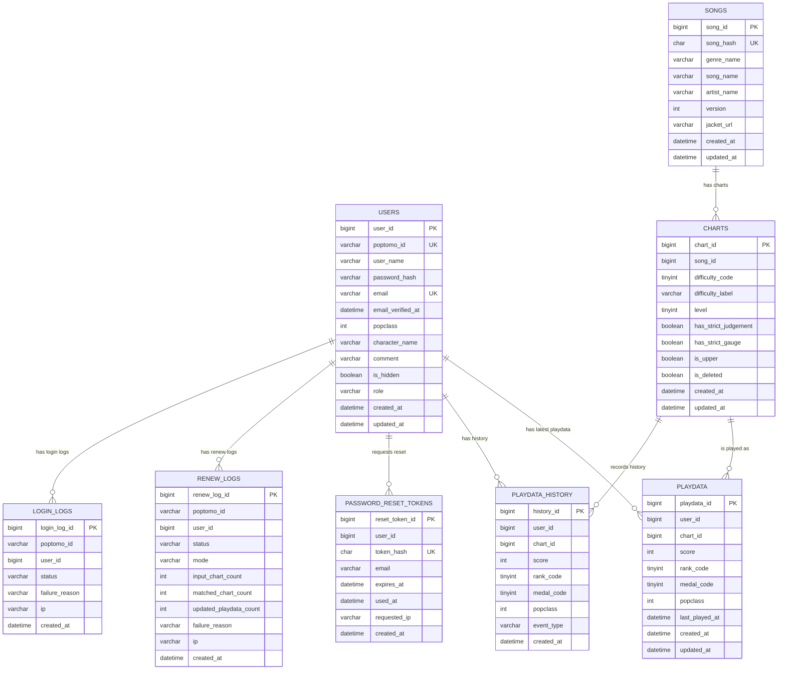

# MVP DB 설계 초안

이 문서는 빠른 MVP 출시를 목표로 한 신규 DB 설계 초안입니다. 원칙은 단순합니다.

- 기존 서비스의 핵심 조회 패턴은 유지합니다.
- `song`과 `chart`는 분리합니다.
- DB foreign key constraint는 만들지 않습니다.
- 대신 id 컬럼, unique key, index, 애플리케이션 검증으로 정합성을 유지합니다.
- 랭크는 점수로 계산하지 않고 크롤링된 값을 저장합니다.
- 확장 기능은 막지 않되, MVP에서 당장 필요하지 않은 테이블은 뒤로 미룹니다.

## MVP 범위

### 포함

- 유저 등록/갱신/로그인
- 이메일 기반 비밀번호 복구
- 곡/채보 조회
- 플레이데이터 갱신
- 유저별 전체 플레이데이터
- 유저 팝클 테이블
- 곡별 랭킹
- 레벨별 랭크/메달 집계
- 갱신 로그
- 플레이데이터 히스토리

### MVP 이후

- 검색 태그 기여
- 한국어 검색 태그 승인 플로우
- 이메일 인증
- 상세 모니터링 테이블
- 관리자 데이터 검수 UI
- 상수 정책 DB 관리 UI

## 테이블 요약

MVP에서는 다음 테이블을 제안합니다.

| 테이블 | 역할 | 기존 대응 |
| --- | --- | --- |
| `users` | 유저 계정과 프로필 | `"user"` |
| `songs` | 곡 단위 메타데이터 | `chart` 일부 |
| `charts` | 난이도별 채보 메타데이터 | `chart` 일부 |
| `playdata` | 유저별 최신 플레이데이터 | `playdata` |
| `playdata_history` | 플레이데이터 변경 이력 | `history` |
| `renew_logs` | 갱신/등록 로그 | `renew_log` |
| `login_logs` | 로그인 로그 | `login_log` |
| `password_reset_tokens` | 이메일 기반 비밀번호 복구 토큰 | 신규 |

MVP에서는 `rank_policy`, `medal_policy`, `difficulty_policy`를 별도 테이블로 만들지 않고 애플리케이션 상수로 둡니다. 버전별 정책 변경을 코드로 감당하기 어려워지는 시점에 테이블로 승격합니다.

## ERD

MVP DB 구조를 읽기 쉽게 그리면 다음과 같습니다.

DB foreign key constraint는 만들지 않지만, 아래 관계는 애플리케이션에서 보장해야 하는 참조 관계입니다.



### 관계 요약

| 관계 | 의미 | DB FK |
| --- | --- | --- |
| `songs 1:N charts` | 한 곡은 여러 난이도 채보를 가집니다. | 없음 |
| `users 1:N playdata` | 한 유저는 여러 최신 플레이데이터를 가집니다. | 없음 |
| `charts 1:N playdata` | 한 채보는 여러 유저의 플레이데이터를 가집니다. | 없음 |
| `users + charts -> playdata unique` | 유저별 채보 최신 상태는 하나만 존재합니다. | unique key |
| `users 1:N playdata_history` | 유저의 변경 이력을 저장합니다. | 없음 |
| `charts 1:N playdata_history` | 채보별 변경 이력을 추적할 수 있습니다. | 없음 |
| `users 1:N password_reset_tokens` | 이메일 비밀번호 복구 토큰을 저장합니다. | 없음 |
| `users 1:N renew_logs/login_logs` | 갱신/로그인 시도 추적용입니다. | 없음 |

## users

기존 `"user"`는 예약어 회피가 번거로우므로 `users`로 바꿉니다.

| 컬럼 | 타입 | 제약 | 설명 |
| --- | --- | --- | --- |
| `user_id` | BIGINT | PK, auto increment | 내부 id |
| `poptomo_id` | VARCHAR(32) | NOT NULL, UNIQUE | 외부 유저 식별자 |
| `user_name` | VARCHAR(64) | NOT NULL | 유저명 |
| `password_hash` | VARCHAR(255) | NOT NULL | 해싱된 비밀번호 |
| `email` | VARCHAR(255) | NULL, UNIQUE | 비밀번호 복구용 이메일 |
| `email_verified_at` | DATETIME | NULL | 이메일 인증 완료 시각 |
| `popclass` | INT | NOT NULL DEFAULT 0 | 유저 팝클 |
| `character_name` | VARCHAR(128) | NOT NULL DEFAULT '' | 캐릭터 |
| `comment` | VARCHAR(255) | NOT NULL DEFAULT '' | 코멘트 |
| `is_hidden` | BOOLEAN | NOT NULL DEFAULT FALSE | 비공개 여부 |
| `normal_credit` | INT | NOT NULL DEFAULT 0 | 노멀 크레딧 |
| `battle_credit` | INT | NOT NULL DEFAULT 0 | 배틀 크레딧 |
| `local_credit` | INT | NOT NULL DEFAULT 0 | 로컬 크레딧 |
| `role` | VARCHAR(20) | NOT NULL DEFAULT 'USER' | `USER`, `ADMIN`, `BOT` |
| `created_at` | DATETIME | NOT NULL | 생성일 |
| `updated_at` | DATETIME | NOT NULL | 수정일 |

### 인덱스

| 인덱스 | 목적 |
| --- | --- |
| unique `poptomo_id` | 로그인/프로필/갱신 조회 |
| unique `email` | 비밀번호 복구 대상 조회 |
| `popclass desc` | 유저 랭킹 |
| `role`, `popclass desc` | BOT 제외 랭킹 |

### 이메일 정책

- 이메일은 MVP에서 비밀번호 복구용으로 사용합니다.
- 기존 유저 중 이메일이 없는 유저는 로그인 후 이메일 등록을 유도합니다.
- 이메일 인증 전에도 저장은 가능하지만, 비밀번호 복구 메일 발송은 `email_verified_at`이 있는 계정으로 제한하는 방향을 권장합니다.
- 운영 부담을 줄이려면 MVP 1차에서는 이메일 등록 즉시 복구 가능하게 하고, 인증 플로우는 빠르게 후속 배포해도 됩니다.

## songs

곡 단위 메타데이터입니다. 기존 `chart`에 중복 저장되던 곡 정보를 분리합니다.

| 컬럼 | 타입 | 제약 | 설명 |
| --- | --- | --- | --- |
| `song_id` | BIGINT | PK, auto increment | 내부 id |
| `song_hash` | CHAR(32) | NOT NULL, UNIQUE | 외부/API 식별자 |
| `genre_name` | VARCHAR(255) | NOT NULL | High☆Cheers 기준 장르명 |
| `song_name` | VARCHAR(255) | NOT NULL | 곡명 |
| `artist_name` | VARCHAR(255) | NULL | 작곡가/아티스트. MVP 마이그레이션 때 없으면 null |
| `version` | INT | NOT NULL | 수록 버전 |
| `jacket_url` | VARCHAR(512) | NULL | 자켓 URL 또는 key |
| `created_at` | DATETIME | NOT NULL | 생성일 |
| `updated_at` | DATETIME | NOT NULL | 수정일 |

### song_hash 정책

MVP 제안:

```text
song_hash = md5(normalizedGenreName + "|" + normalizedSongName + "|" + normalizedArtistName + "|" + version + "|" + isUpperGroup)
```

단, MVP 마이그레이션 시 `artist_name`이 없다면 `''`로 둡니다.

주의:

- `isUpper`는 실제로 곡을 나눠야 하는 경우에만 hash seed에 들어갑니다.
- 모든 Upper를 별도 song으로 나눌지, 같은 song의 chart 속성으로 둘지는 데이터 중복 확인 후 확정합니다.
- 기존 hash와 신규 hash 매핑은 마이그레이션 산출물로 반드시 남깁니다.

### 인덱스

| 인덱스 | 목적 |
| --- | --- |
| unique `song_hash` | 외부/API 조회 |
| `version`, `song_name` | 곡 목록 정렬 |
| `genre_name`, `song_name` | 기본 검색 |
| `song_name` | 곡명 검색 |

## charts

난이도별 채보 메타데이터입니다.

| 컬럼 | 타입 | 제약 | 설명 |
| --- | --- | --- | --- |
| `chart_id` | BIGINT | PK, auto increment | 내부 id |
| `song_id` | BIGINT | NOT NULL | `songs.song_id`를 가리키는 애플리케이션 참조 |
| `difficulty_code` | TINYINT | NOT NULL | `1~4`, MVP에서는 기존 코드 유지 |
| `difficulty_label` | VARCHAR(16) | NOT NULL | `LIGHT`, `NORMAL`, `HYPER`, `EX` |
| `level` | TINYINT | NOT NULL | 레벨 |
| `has_strict_judgement` | BOOLEAN | NOT NULL DEFAULT FALSE | 짠판정 여부 |
| `has_strict_gauge` | BOOLEAN | NOT NULL DEFAULT FALSE | 짠게이지 여부 |
| `is_upper` | BOOLEAN | NOT NULL DEFAULT FALSE | Upper 여부. 표시 딱지는 제거해도 데이터는 보존 |
| `is_deleted` | BOOLEAN | NOT NULL DEFAULT FALSE | 삭제 여부 |
| `created_at` | DATETIME | NOT NULL | 생성일 |
| `updated_at` | DATETIME | NOT NULL | 수정일 |

팝픈은 곡 또는 채보마다 짠판정, 짠게이지 특성이 존재합니다. 난이도별로 달라질 가능성을 열어두기 위해 MVP에서는 `charts`에 둡니다. 실제 데이터가 곡 단위로만 존재한다고 확인되면 API 응답에서 곡 단위 요약값으로 집계할 수 있습니다.

### 인덱스

| 인덱스 | 목적 |
| --- | --- |
| unique `song_id`, `difficulty_code` | 곡별 난이도 중복 방지 |
| `level`, `is_deleted` | 레벨별 목록/집계 |
| `difficulty_code`, `level` | 난이도/레벨 필터 |
| `song_id`, `is_deleted` | 곡 상세에서 채보 목록 조회 |

## playdata

유저별 최신 플레이데이터입니다.

| 컬럼 | 타입 | 제약 | 설명 |
| --- | --- | --- | --- |
| `playdata_id` | BIGINT | PK, auto increment | 내부 id |
| `user_id` | BIGINT | NOT NULL | `users.user_id`를 가리키는 애플리케이션 참조 |
| `chart_id` | BIGINT | NOT NULL | `charts.chart_id`를 가리키는 애플리케이션 참조 |
| `score` | INT | NOT NULL | 점수 |
| `rank_code` | TINYINT | NOT NULL | 크롤링된 랭크 코드 |
| `medal_code` | TINYINT | NOT NULL | 크롤링된 메달 코드 |
| `popclass` | INT | NOT NULL DEFAULT 0 | 해당 채보 기준 팝클 |
| `last_played_at` | DATETIME | NULL | 원천 데이터에서 플레이일을 얻을 수 있으면 저장 |
| `created_at` | DATETIME | NOT NULL | 생성일 |
| `updated_at` | DATETIME | NOT NULL | 수정일 |

### 중요 정책

- `rank_code`는 서버가 `score`로 계산하지 않습니다.
- 갱신/크롤링 입력에 `score`, `rank_code`, `medal_code`가 함께 들어와야 합니다.
- `popclass`는 서버에서 계산해서 저장합니다.

### 인덱스

| 인덱스 | 목적 |
| --- | --- |
| unique `user_id`, `chart_id` | 최신 플레이데이터 upsert |
| `user_id`, `popclass desc`, `score desc` | 유저 팝클 상위 50 |
| `user_id`, `chart_id` | 유저별 단일 채보 조회 |
| `chart_id`, `score desc` | 곡별 점수 랭킹 |
| `chart_id`, `medal_code`, `score desc` | 곡별 메달 우선 랭킹 |
| `user_id`, `rank_code` | 유저 rank 집계 |
| `user_id`, `medal_code` | 유저 medal 집계 |

## playdata_history

이력 테이블입니다. 기존 `history` 역할을 유지하되 이름을 명확하게 바꿉니다.

| 컬럼 | 타입 | 제약 | 설명 |
| --- | --- | --- | --- |
| `history_id` | BIGINT | PK, auto increment | 내부 id |
| `user_id` | BIGINT | NOT NULL | 유저 id |
| `chart_id` | BIGINT | NOT NULL | 채보 id |
| `score` | INT | NOT NULL | 당시 점수 |
| `rank_code` | TINYINT | NOT NULL | 당시 랭크 |
| `medal_code` | TINYINT | NOT NULL | 당시 메달 |
| `popclass` | INT | NOT NULL | 당시 채보 팝클 |
| `event_type` | VARCHAR(32) | NOT NULL | `REGISTER`, `SCORE_UP`, `RANK_UP`, `MEDAL_UP`, `MANUAL` |
| `created_at` | DATETIME | NOT NULL | 이력 생성일 |

### 생성 조건

MVP에서는 다음 조건에서 history를 남깁니다.

- 신규 플레이데이터 등록
- 점수 상승
- 랭크 상승
- 메달 상승

랭크/메달의 우열 비교는 애플리케이션 상수의 `sortOrder`를 사용합니다.

### 인덱스

| 인덱스 | 목적 |
| --- | --- |
| `user_id`, `chart_id`, `created_at desc` | 특정 유저/곡 히스토리 |
| `user_id`, `created_at desc` | 유저 최근 갱신 |
| `chart_id`, `created_at desc` | 곡 최근 갱신 |

## renew_logs

갱신/등록 로그입니다.

| 컬럼 | 타입 | 제약 | 설명 |
| --- | --- | --- | --- |
| `renew_log_id` | BIGINT | PK, auto increment | 내부 id |
| `poptomo_id` | VARCHAR(32) | NULL | 대상 팝토모 ID |
| `user_id` | BIGINT | NULL | 유저 id. 유저 생성 전 실패할 수 있어 nullable |
| `status` | VARCHAR(20) | NOT NULL | `SUCCESS`, `FAILED`, `PARTIAL` |
| `mode` | VARCHAR(20) | NOT NULL | `REGISTER`, `RENEW` |
| `input_chart_count` | INT | NOT NULL DEFAULT 0 | 입력 row 수 |
| `matched_chart_count` | INT | NOT NULL DEFAULT 0 | 매칭 성공 row 수 |
| `updated_playdata_count` | INT | NOT NULL DEFAULT 0 | 저장/갱신 row 수 |
| `failure_reason` | VARCHAR(1024) | NULL | 실패 사유 |
| `ip` | VARCHAR(45) | NULL | IPv4/IPv6 |
| `created_at` | DATETIME | NOT NULL | 생성일 |

기존처럼 비밀번호나 민감정보는 저장하지 않습니다.

## login_logs

로그인 로그입니다.

| 컬럼 | 타입 | 제약 | 설명 |
| --- | --- | --- | --- |
| `login_log_id` | BIGINT | PK, auto increment | 내부 id |
| `poptomo_id` | VARCHAR(32) | NULL | 시도한 팝토모 ID |
| `user_id` | BIGINT | NULL | 성공 또는 매칭된 유저 id |
| `status` | VARCHAR(20) | NOT NULL | `SUCCESS`, `FAILED` |
| `failure_reason` | VARCHAR(255) | NULL | 실패 사유 |
| `ip` | VARCHAR(45) | NULL | IPv4/IPv6 |
| `created_at` | DATETIME | NOT NULL | 생성일 |

주의: password는 절대 저장하지 않습니다.

## password_reset_tokens

비밀번호 복구 요청 시 발급하는 일회용 토큰입니다.

| 컬럼 | 타입 | 제약 | 설명 |
| --- | --- | --- | --- |
| `reset_token_id` | BIGINT | PK, auto increment | 내부 id |
| `user_id` | BIGINT | NOT NULL | 대상 유저 id |
| `token_hash` | CHAR(64) | NOT NULL, UNIQUE | 원문 토큰의 SHA-256 해시 |
| `email` | VARCHAR(255) | NOT NULL | 발송 당시 이메일 |
| `expires_at` | DATETIME | NOT NULL | 만료 시각 |
| `used_at` | DATETIME | NULL | 사용 완료 시각 |
| `requested_ip` | VARCHAR(45) | NULL | 요청 IP |
| `created_at` | DATETIME | NOT NULL | 생성일 |

### 보안 정책

- 원문 reset token은 DB에 저장하지 않습니다.
- DB에는 `sha256(token)`만 저장합니다.
- 토큰은 15~30분 정도의 짧은 TTL을 권장합니다.
- 토큰은 1회만 사용할 수 있습니다.
- 새 토큰 발급 시 같은 유저의 미사용 토큰을 만료시키거나, 최신 토큰만 허용합니다.
- 응답 메시지는 이메일 존재 여부를 노출하지 않습니다.
- 너무 잦은 요청은 IP와 `poptomo_id/email` 단위 rate limit을 둡니다.

### 인덱스

| 인덱스 | 목적 |
| --- | --- |
| unique `token_hash` | 토큰 검증 |
| `user_id`, `used_at`, `expires_at` | 유저별 활성 토큰 조회/무효화 |
| `email`, `created_at desc` | 복구 요청 추적 |

## 랭크/메달/난이도 코드

MVP에서는 상수 테이블 없이 코드 상수로 시작합니다.

### rank_code 초안

낮은 값이 좋은 랭크였던 기존 관성을 유지할 수 있습니다. 다만 외부 API에서는 label을 함께 내려줍니다.

| 코드 | 라벨 | 참고 점수 |
| --- | --- | --- |
| 1 | `S+` | 99,000 이상 |
| 2 | `S` | 98,000 - 98,999 |
| 3 | `AAA` | 95,000 - 97,999 |
| 4 | `AA+` | 93,000 - 94,999 |
| 5 | `AA` | 90,000 - 92,999 |
| 6 | `A+` | 86,000 - 89,999 |
| 7 | `A` | 82,000 이상 |
| 8 | `B+` | 77,000 - 81,999 |
| 9 | `B` | 72,000 - 76,999 |
| 10 | `C` | 62,000 - 71,999 |
| 11 | `D` | 50,000 - 61,999 |
| 12 | `E` | 49,999 이하 |

이 표는 정렬/표시/검증용입니다. 서버는 점수로 랭크를 산출하지 않습니다.

### difficulty_code 초안

| 코드 | 라벨 | 짧은 라벨 |
| --- | --- | --- |
| 1 | `LIGHT` | `L` |
| 2 | `NORMAL` | `N` |
| 3 | `HYPER` | `H` |
| 4 | `EX` | `EX` |

### medal_code

정확한 기존 코드표와 신규 `어시이지`의 위치 확인이 필요합니다. MVP에서는 기존 코드값을 최대한 유지하고, label mapping만 High☆Cheers 기준으로 갱신합니다.

## DDL 초안

MySQL 기준 초안입니다. 실제 구현에서는 Flyway `src/main/resources/db/migration/V*.sql` 파일로 나눠 관리합니다.

권장 분할:

```text
V1__init_users.sql
V2__create_songs_and_charts.sql
V3__create_playdata.sql
V4__create_logs.sql
V5__create_password_reset_tokens.sql
```

운영에 적용된 Flyway `V` 파일은 수정하지 않고, 변경이 필요하면 새 버전 파일을 추가합니다.

```sql
CREATE TABLE users (
    user_id BIGINT AUTO_INCREMENT PRIMARY KEY,
    poptomo_id VARCHAR(32) NOT NULL,
    user_name VARCHAR(64) NOT NULL,
    password_hash VARCHAR(255) NOT NULL,
    email VARCHAR(255) NULL,
    email_verified_at DATETIME NULL,
    popclass INT NOT NULL DEFAULT 0,
    character_name VARCHAR(128) NOT NULL DEFAULT '',
    comment VARCHAR(255) NOT NULL DEFAULT '',
    is_hidden BOOLEAN NOT NULL DEFAULT FALSE,
    normal_credit INT NOT NULL DEFAULT 0,
    battle_credit INT NOT NULL DEFAULT 0,
    local_credit INT NOT NULL DEFAULT 0,
    role VARCHAR(20) NOT NULL DEFAULT 'USER',
    created_at DATETIME NOT NULL,
    updated_at DATETIME NOT NULL,
    UNIQUE KEY uk_users_poptomo_id (poptomo_id),
    UNIQUE KEY uk_users_email (email),
    KEY idx_users_popclass (popclass DESC),
    KEY idx_users_role_popclass (role, popclass DESC)
) ENGINE=InnoDB DEFAULT CHARSET=utf8mb4 COLLATE=utf8mb4_unicode_ci;

CREATE TABLE songs (
    song_id BIGINT AUTO_INCREMENT PRIMARY KEY,
    song_hash CHAR(32) NOT NULL,
    genre_name VARCHAR(255) NOT NULL,
    song_name VARCHAR(255) NOT NULL,
    artist_name VARCHAR(255) NULL,
    version INT NOT NULL,
    jacket_url VARCHAR(512) NULL,
    created_at DATETIME NOT NULL,
    updated_at DATETIME NOT NULL,
    UNIQUE KEY uk_songs_song_hash (song_hash),
    KEY idx_songs_version_name (version, song_name),
    KEY idx_songs_genre_name (genre_name, song_name),
    KEY idx_songs_name (song_name)
) ENGINE=InnoDB DEFAULT CHARSET=utf8mb4 COLLATE=utf8mb4_unicode_ci;

CREATE TABLE charts (
    chart_id BIGINT AUTO_INCREMENT PRIMARY KEY,
    song_id BIGINT NOT NULL,
    difficulty_code TINYINT NOT NULL,
    difficulty_label VARCHAR(16) NOT NULL,
    level TINYINT NOT NULL,
    has_strict_judgement BOOLEAN NOT NULL DEFAULT FALSE,
    has_strict_gauge BOOLEAN NOT NULL DEFAULT FALSE,
    is_upper BOOLEAN NOT NULL DEFAULT FALSE,
    is_deleted BOOLEAN NOT NULL DEFAULT FALSE,
    created_at DATETIME NOT NULL,
    updated_at DATETIME NOT NULL,
    UNIQUE KEY uk_charts_song_difficulty (song_id, difficulty_code),
    KEY idx_charts_level_deleted (level, is_deleted),
    KEY idx_charts_difficulty_level (difficulty_code, level),
    KEY idx_charts_song_deleted (song_id, is_deleted)
) ENGINE=InnoDB DEFAULT CHARSET=utf8mb4 COLLATE=utf8mb4_unicode_ci;

CREATE TABLE playdata (
    playdata_id BIGINT AUTO_INCREMENT PRIMARY KEY,
    user_id BIGINT NOT NULL,
    chart_id BIGINT NOT NULL,
    score INT NOT NULL,
    rank_code TINYINT NOT NULL,
    medal_code TINYINT NOT NULL,
    popclass INT NOT NULL DEFAULT 0,
    last_played_at DATETIME NULL,
    created_at DATETIME NOT NULL,
    updated_at DATETIME NOT NULL,
    UNIQUE KEY uk_playdata_user_chart (user_id, chart_id),
    KEY idx_playdata_user_popclass (user_id, popclass DESC, score DESC),
    KEY idx_playdata_chart_score (chart_id, score DESC),
    KEY idx_playdata_chart_medal_score (chart_id, medal_code, score DESC),
    KEY idx_playdata_user_rank (user_id, rank_code),
    KEY idx_playdata_user_medal (user_id, medal_code)
) ENGINE=InnoDB DEFAULT CHARSET=utf8mb4 COLLATE=utf8mb4_unicode_ci;

CREATE TABLE playdata_history (
    history_id BIGINT AUTO_INCREMENT PRIMARY KEY,
    user_id BIGINT NOT NULL,
    chart_id BIGINT NOT NULL,
    score INT NOT NULL,
    rank_code TINYINT NOT NULL,
    medal_code TINYINT NOT NULL,
    popclass INT NOT NULL,
    event_type VARCHAR(32) NOT NULL,
    created_at DATETIME NOT NULL,
    KEY idx_history_user_chart_created (user_id, chart_id, created_at DESC),
    KEY idx_history_user_created (user_id, created_at DESC),
    KEY idx_history_chart_created (chart_id, created_at DESC)
) ENGINE=InnoDB DEFAULT CHARSET=utf8mb4 COLLATE=utf8mb4_unicode_ci;

CREATE TABLE renew_logs (
    renew_log_id BIGINT AUTO_INCREMENT PRIMARY KEY,
    poptomo_id VARCHAR(32) NULL,
    user_id BIGINT NULL,
    status VARCHAR(20) NOT NULL,
    mode VARCHAR(20) NOT NULL,
    input_chart_count INT NOT NULL DEFAULT 0,
    matched_chart_count INT NOT NULL DEFAULT 0,
    updated_playdata_count INT NOT NULL DEFAULT 0,
    failure_reason VARCHAR(1024) NULL,
    ip VARCHAR(45) NULL,
    created_at DATETIME NOT NULL,
    KEY idx_renew_logs_poptomo_created (poptomo_id, created_at DESC),
    KEY idx_renew_logs_status_created (status, created_at DESC)
) ENGINE=InnoDB DEFAULT CHARSET=utf8mb4 COLLATE=utf8mb4_unicode_ci;

CREATE TABLE login_logs (
    login_log_id BIGINT AUTO_INCREMENT PRIMARY KEY,
    poptomo_id VARCHAR(32) NULL,
    user_id BIGINT NULL,
    status VARCHAR(20) NOT NULL,
    failure_reason VARCHAR(255) NULL,
    ip VARCHAR(45) NULL,
    created_at DATETIME NOT NULL,
    KEY idx_login_logs_poptomo_created (poptomo_id, created_at DESC),
    KEY idx_login_logs_status_created (status, created_at DESC)
) ENGINE=InnoDB DEFAULT CHARSET=utf8mb4 COLLATE=utf8mb4_unicode_ci;

CREATE TABLE password_reset_tokens (
    reset_token_id BIGINT AUTO_INCREMENT PRIMARY KEY,
    user_id BIGINT NOT NULL,
    token_hash CHAR(64) NOT NULL,
    email VARCHAR(255) NOT NULL,
    expires_at DATETIME NOT NULL,
    used_at DATETIME NULL,
    requested_ip VARCHAR(45) NULL,
    created_at DATETIME NOT NULL,
    UNIQUE KEY uk_password_reset_tokens_hash (token_hash),
    KEY idx_password_reset_tokens_user_active (user_id, used_at, expires_at),
    KEY idx_password_reset_tokens_email_created (email, created_at DESC)
) ENGINE=InnoDB DEFAULT CHARSET=utf8mb4 COLLATE=utf8mb4_unicode_ci;
```

## 기존 DB에서 신규 DB로 매핑

| 기존 | 신규 | 변환 |
| --- | --- | --- |
| `"user"` | `users` | `password` -> `password_hash`, `"character"` -> `character_name`, `email`은 신규 nullable |
| `chart` | `songs` | `song_hash`, `genre_name`, `song_name`, `version`, `jacket`를 곡 단위로 dedupe |
| `chart` | `charts` | `difficulty`, `level`, `is_upper`, `is_deleted`를 난이도별로 이전 |
| `playdata` | `playdata` | old `chart_id`를 new `chart_id`로 매핑 |
| `history` | `playdata_history` | old `chart_id`를 new `chart_id`로 매핑 |
| `renew_log` | `renew_logs` | 컬럼명 정리 |
| `login_log` | `login_logs` | password 폐기 |

## MVP에서 보류하는 것

| 항목 | 보류 이유 | 추후 방향 |
| --- | --- | --- |
| `rank_policy` 테이블 | MVP에서는 코드 상수로 충분 | 운영 중 변경이 잦아지면 테이블화 |
| `medal_policy` 테이블 | 신규 어시이지 코드 확정 필요 | 코드표 확정 후 테이블화 |
| `difficulty_policy` 테이블 | High☆Cheers 기준 4개 라벨이면 충분 | 버전별 표시가 복잡해지면 테이블화 |
| 검색 태그 | MVP 핵심 경로 아님 | `song_search_tags` 추가 |

## 남은 결정 사항

- 신규 `song_hash` seed에 `artist_name`을 넣을 수 있는가?
- Upper는 별도 song으로 볼 것인가, 같은 song의 chart 속성으로만 볼 것인가?
- 기존 medal 코드표와 신규 `어시이지` 코드값은 어디에 배치할 것인가?
- `last_played_at`을 크롤링 원천에서 얻을 수 있는가?
- 기존 password가 실제 원문인지, 외부 secret인지, 이미 hash인지 확인해야 합니다.
- 이메일 인증을 MVP 1차에 포함할 것인가, 이메일 등록 후 복구만 먼저 열 것인가?
- 비밀번호 복구 메일 발송 provider는 무엇을 쓸 것인가?
- LONG POP ON/OFF 전환 시 점수와 팝클 계산에 어떤 기록이 남는지 검증해야 합니다.

## 리서치 기반 확장 후보

High☆Cheers 공식/공개 자료를 보면 곡 목록에서 `GENRE`, `TITLE`, `ARTIST`, `CHARA`, `BPM`, `L/N/H/EX`가 중요한 표시 정보로 쓰입니다. MVP DDL에는 최소 필드만 넣지만, 다음 필드는 빠르게 추가될 가능성이 높습니다.

| 테이블 | 후보 필드 | 이유 |
| --- | --- | --- |
| `songs` | `bpm_min`, `bpm_max` | 곡 상세와 검색 필터 품질 개선 |
| `songs` | `default_character_name` | 곡 목록/상세에서 CHARA 표시 |
| `songs` | `release_date` | 최신 차트 정렬을 `created_at`보다 정확히 처리 |
| `songs` | `event_name` | 이벤트/해금 곡 분류 |
| `songs` | `source_category` | default, event, license, collab 등 구분 |
| `songs` | `source_url` | 크롤링 출처 추적 |
| `charts` | `note_count` | 점수/난이도 분석 확장 |
| `playdata` | `long_pop_mode` | LONG POP ON/OFF 원천값이 확인될 경우 후보 |
| `playdata_history` | `raw_score`, `raw_medal_code` | LONG POP ON/OFF 검증 중 원천 기록 보존 후보 |

자세한 리서치 결과는 [서비스와 게임 리서치](planning/service-research.md)를 참고합니다.
